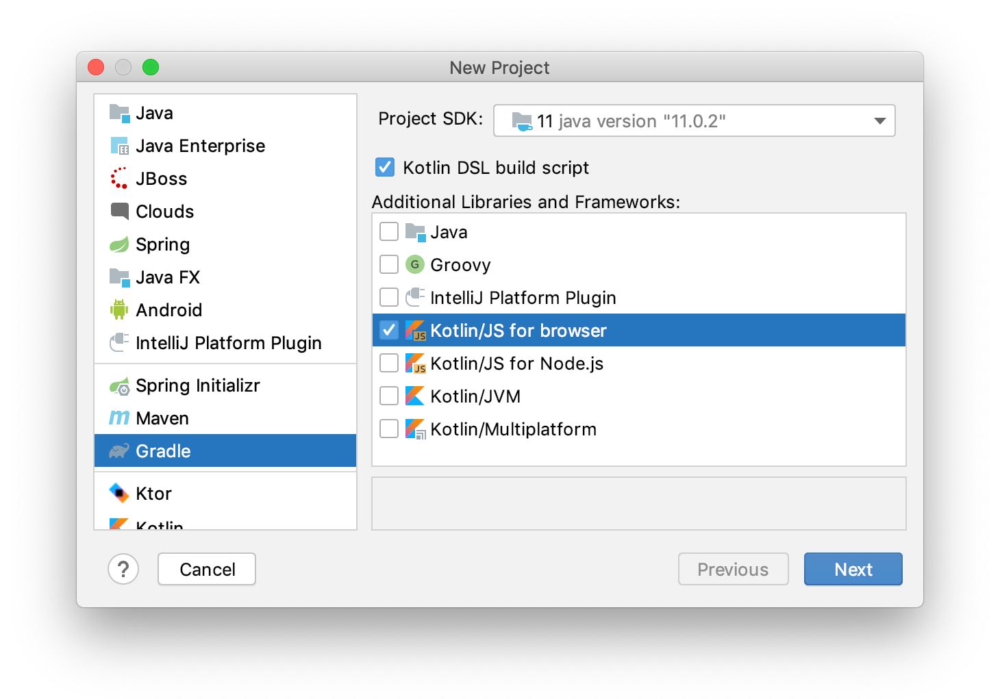
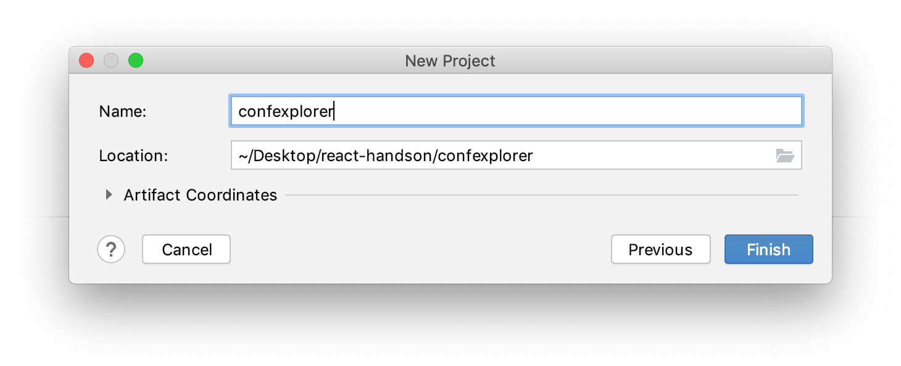
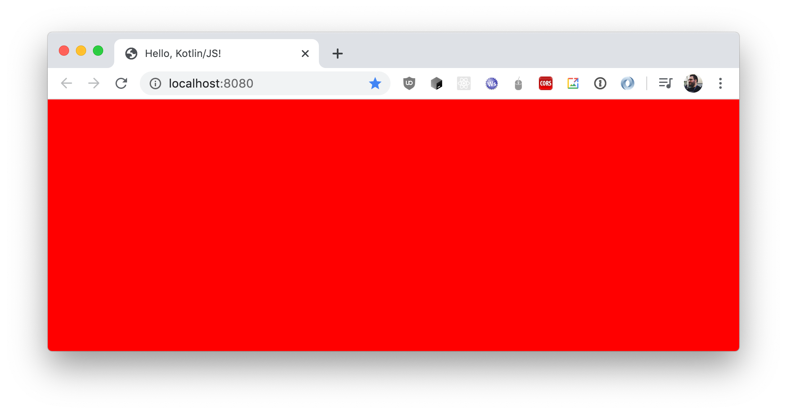
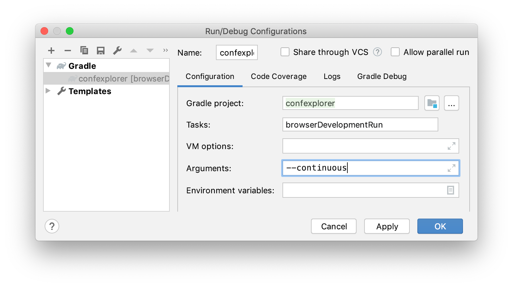

# Setting up

### Prerequisites

To get started, let's make sure we have installed an up-to-date development environment. All we need to get started is:

- IntelliJ IDEA (version `2020.1` or above) with the Kotlin plugin (`1.4.0` or above) – [Download/Install](https://www.jetbrains.com/idea/download/)


### Setting up the project

We are going to set up our project using the `org.jetbrains.kotlin.js` Gradle plugin. This state-of-the-art plugin takes care of managing a development environment for us that uses all the latest and greatest things from the JavaScript ecosystem – under the hood, it equips us with a `yarn` and `webpack` installation. If we need to make adjustments, we can do so through Gradle – and with just a little bit of configuration, it will allow us to accomplish all the tasks we are going to encounter on our learning journey.

The easiest way to get started is through the wizard provided by IntelliJ IDEA. From the splash screen or from the `File` menu, we select `New/Project...`. We choose the `Gradle` category, turn on the `Kotlin DSL build script`, and select only `Kotlin/JS for browser` as our target:



After clicking the `Next` button, we get to give our project a name. I named my project `confexplorer` – because that is what we are building – but feel free to get creative with your naming:



After clicking finish, we can lean back for a few seconds as Gradle initialises a blank project for us that supports JavaScript as a Kotlin compilation target. Once the import has finished, it's time to bring in all those dependencies we will require for the rest of the hands-on.

#### Gradle dependencies and tasks

Throughout the hands-on, we will make use of React, some external dependencies, and even some Kotlin-specific libraries. To save ourselves from running Gradle imports after each chapter, we will add all dependencies right now. The topics related to each set of dependencies is described in the annotated chapter.

Inside our `build.gradle.kts` file, let's make sure that our `repositories` block looks as follows:

```kotlin
repositories {
    maven("https://kotlin.bintray.com/kotlin-js-wrappers/")
    mavenCentral()
    jcenter()
}
```

Now that we have all sources for our dependencies, let's make sure we include everything we need in our `dependencies` block.

```kotlin
dependencies {
    implementation(kotlin("stdlib-js"))

    //React, React DOM + Wrappers (chapter 3)
    implementation("org.jetbrains:kotlin-react:16.13.1-pre.110-kotlin-1.4.0")
    implementation("org.jetbrains:kotlin-react-dom:16.13.1-pre.110-kotlin-1.4.0")
    implementation(npm("react", "16.13.1"))
    implementation(npm("react-dom", "16.13.1"))

    //Kotlin Styled (chapter 3)
    implementation("org.jetbrains:kotlin-styled:1.0.0-pre.110-kotlin-1.4.0")
    implementation(npm("styled-components", "~5.1.1"))
    implementation(npm("inline-style-prefixer", "~6.0.0"))

    //Video Player (chapter 7)
    implementation(npm("react-player", "~2.6.0"))

    //Share Buttons (chapter 7)
    implementation(npm("react-share", "~4.2.1"))

    //Coroutines (chapter 8)
    implementation("org.jetbrains.kotlinx:kotlinx-coroutines-core:1.3.9")
}
```

After editing the file, IntelliJ IDEA will automatically prompt us import the changed Gradle files. Alternatively, we can also press the "🔁 Reimport All Gradle Projects" button in the Gradle tool window.

#### HTML page

Because we can't run JavaScript out of nowhere, we need to provide an HTML page (linked to our compiled JS file) that can be loaded in a browser. Let's create the file `/src/main/resources/index.html` and fill it with the following content:

```xml
<!doctype html>
<html lang="en">
<head>
    <meta charset="UTF-8">
    <title>Hello, Kotlin/JS!</title>
</head>
<body>
    <div id="root"></div>
    <script src="confexplorer.js"></script>
</body>
</html>
```

Depending on how we named our project, the embedded `js` file has a different name. For example, if you named your project `followingAlong`, make sure to embed `followingAlong.js`. Thanks to the Gradle plugin, all of our code and dependencies will be bundled up into this single JavaScript artifact that bears the same name as our project.

Now, before we write a proper "Hello, World" with actual Markup, let's start with a very simple and visual example – a solid colored page. This is just to verify that what we're building is actually reaching the browser and executes fine. For this, we create the file `src/main/kotlin/Main.kt` and fill it with the following Kotlin code snippet:

```kotlin
import kotlinx.browser.document

fun main() {
    document.bgColor = "red"
}
```

Now, we need to compile, run, and serve our code.

### Running the development server

The `kotlin.js` Gradle plugin comes by default with support for an embedded `webpack-dev-server`, which allows us to run the application from our IDE without having to manually set up any kind of server.

We can start the development server by invoking the `run` or `browserDevelopmentRun` task from the Gradle tool window inside IntelliJ IDEA:


If you would like to run the program from the Terminal instead, you can do so via `./gradlew run`.

Our project is compiled and bundled, and after a few seconds, a browser window should open up that shows a red, blank page – the indication that our code is running fine:



#### Enabling hot reload / continous mode

Instead of manually compiling and executing our project every time we want to see the changes we made, we can make use of the _continuous compilation_ mode that is supported by Kotlin/JS. Instead of using the regular `run` command, we instead invoke Gradle in _continuous_ mode.

Make sure to stop all running development server instances before proceeding.

From inside IntelliJ IDEA, we can pass the same flag via the _run configuration_. After running the Gradle `run` task for the first time from the IDE, IntelliJ IDEA automatically generates a run configuration for it, which we can edit:


In the "Run/Debug Configurations" dialog, we can add the `--continuous` flag to the arguments for the run configuration:



After applying the changes to our run configuration, we can use the play button inside IntelliJ IDEA to start our development server back up.

If you would like to run the Gradle continous builds from the Terminal instead, you can do so via `./gradlew run --continuous`.

To test the feature we have just enabled, let's change the color of the page while the Gradle task is running. We could, for example, change it to blue:

```kotlin
document.bgColor = "blue"
```

If everything goes well, a couple seconds after saving our change, the project should be recompiled, and our browser page reloads, reflecting the new hue.

During development, feel free to leave the development server running. It will watch for the changes we make in our code, automatically recompile, and reload the page while it is running. If you'd like, you can play around for a bit in this beginning stage, and then continue.

### Ready, set...

We have set up our blank slate of endless possibilities. Let’s get started!

You can find the state of the project after this section on the `master` branch in the [GitHub](https://github.com/kotlin-hands-on/web-app-react-kotlin-js-gradle/tree/master) repository.

