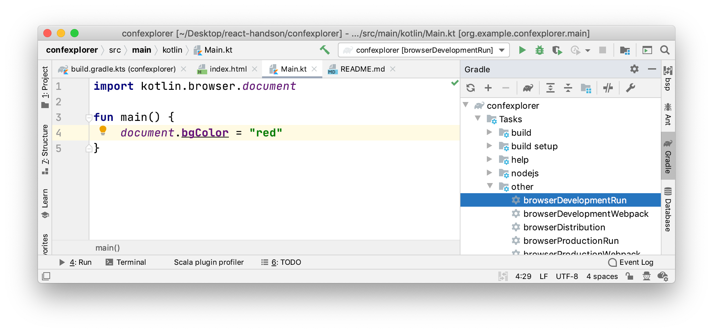
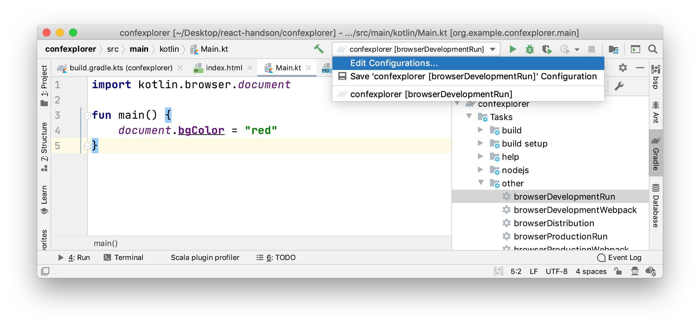

# Setting up

### Prerequisites

To get started, let's make sure we have installed an up-to-date development environment. All we need to get started is:

- IntelliJ IDEA (version `2020.3` or above) with the Kotlin plugin (`1.4.30` or above) – [Download/Install](https://www.jetbrains.com/idea/download/)


### Setting up the project

For this tutorial, we have made a starter template available that includes all configuration and required dependencies for the project.

[**Please clone the project repository from GitHub, and open it in IntelliJ IDEA.**](https://github.com/kotlin-hands-on/web-app-react-kotlin-js-gradle)

The template repository contains a basic Kotlin/JS Gradle project for us to build our project. Because it already contains all dependencies that we will need throughout the hands-on, **you don't need to make any changes to the Gradle configuration.**

It is still beneficial to understand what artifacts are being used for the application, so let's have a closer look at our project template and the dependencies and configuration it relies on.


#### Gradle dependencies and tasks

Throughout the hands-on, we will make use of React, some external dependencies, and even some Kotlin-specific libraries. The topics related to each set of dependencies is described in the annotated chapter.

Our buildfile's `dependencies` block contains everything we'll need:

```kotlin
dependencies {

    //React, React DOM + Wrappers (chapter 3)
    implementation("org.jetbrains:kotlin-react:17.0.1-pre.148-kotlin-1.4.21")
    implementation("org.jetbrains:kotlin-react-dom:17.0.1-pre.148-kotlin-1.4.21")
    implementation(npm("react", "17.0.1"))
    implementation(npm("react-dom", "17.0.1"))

    //Kotlin Styled (chapter 3)
    implementation("org.jetbrains:kotlin-styled:5.2.1-pre.148-kotlin-1.4.21")
    implementation(npm("styled-components", "~5.2.1"))

    //Video Player (chapter 7)
    implementation(npm("react-youtube-lite", "1.0.1"))

    //Share Buttons (chapter 7)
    implementation(npm("react-share", "~4.2.1"))

    //Coroutines (chapter 8)
    implementation("org.jetbrains.kotlinx:kotlinx-coroutines-core:1.4.3")
}
```


#### HTML page

Because we can't run JavaScript out of nowhere, we also need an HTML page to insert out HTML into. The file `/src/main/resources/index.html` is provided and filled accordingly:

```xml
<!doctype html>
<html lang="en">
<head>
    <meta charset="UTF-8">
    <title>Hello, Kotlin/JS!</title>
</head>
<body>
    <div id="root"></div>
    <script src="confexplorer.js"></script>
</body>
</html>
```

As you can see, we're embedding a JavaScript file called `confexplorer.js`. This is because the Kotlin/JS Gradle plugin will bundle all of our code and its dependencies into a single JavaScript file, which has the same name as our project. (That also means that if you're working in a project you've named `followingAlong`, you need to make sure to embed `followingAlong.js` instead.)

Now, before we write a proper "Hello, World" with actual markup, we start with a very simple and visual example – a solid colored page. This is just to verify that what we're building is actually reaching the browser and executes fine. For this, we have the file `src/main/kotlin/Main.kt`, filled with the following code snippet:

```kotlin
import kotlinx.browser.document

fun main() {
    document.bgColor = "red"
}
```

Now, we need to compile, run, and serve our code.

### Running the development server

The `kotlin.js` Gradle plugin comes by default with support for an embedded `webpack-dev-server`, which allows us to run the application from our IDE without having to manually set up any kind of server.

We can start the development server by invoking the `run` or `browserDevelopmentRun`(available in `other` directory or `kotlin browser` directory) task from the Gradle tool window inside IntelliJ IDEA:



If you would like to run the program from the Terminal instead, you can do so via `./gradlew run`.

Our project is compiled and bundled, and after a few seconds, a browser window should open up that shows a red, blank page – the indication that our code is running fine:


#### Enabling hot reload / continous mode

Instead of manually compiling and executing our project every time we want to see the changes we made, we can make use of the _continuous compilation_ mode that is supported by Kotlin/JS. Instead of using the regular `run` command, we instead invoke Gradle in _continuous_ mode.

Make sure to stop all running development server instances before proceeding.

From inside IntelliJ IDEA, we can pass the same flag via the _run configuration_. After running the Gradle `run` task for the first time from the IDE, IntelliJ IDEA automatically generates a run configuration for it, which we can edit:



In the "Run/Debug Configurations" dialog, we can add the `--continuous` flag to the arguments for the run configuration:


After applying the changes to our run configuration, we can use the play button inside IntelliJ IDEA to start our development server back up.

If you would like to run the Gradle continous builds from the Terminal instead, you can do so via `./gradlew run --continuous`.

To test the feature we have just enabled, let's change the color of the page while the Gradle task is running. We could, for example, change it to blue:

```kotlin
document.bgColor = "blue"
```

If everything goes well, a couple seconds after saving our change, the project should be recompiled, and our browser page reloads, reflecting the new hue.

During development, feel free to leave the development server running. It will watch for the changes we make in our code, automatically recompile, and reload the page while it is running. If you'd like, you can play around for a bit in this beginning stage, and then continue.

### Ready, set...

We have set up our blank slate of endless possibilities. Let’s get started!

You can find the state of the project after this section on the `master` branch in the [GitHub](https://github.com/kotlin-hands-on/web-app-react-kotlin-js-gradle/tree/master) repository.

