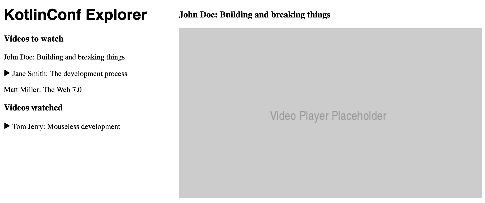

# Working together: Composing components

The two lists we built in the previous sections work nicely on their own. However, after clicking on a video in the "unwatched videos" list and in the "watched videos" list, we can see that we can select *two* videos, even though we only have one player:



The reality is that both lists share some overarching state: the selected video (as there can only be one selected video application-wide). However, this shared state can't (and shouldn't be) stored within the individual components, but *lifted out*.

### Lifting state

To prevent components from being hard-wired together in strange, criss-cross ways, React props are always passed in from the *parent* component, enforcing a proper hierarchy. If different components want to change the state of their sibling components, they can only do it through their parent. At that point, the state is no longer that of a sibling component, but of the parent component. The process of migrating state from components to their parents is called *lifting state*. So, let's lift some state! For this, we need to add state to our `App` component. The scheme we are following is very similar to that of the `VideoList`. 

We define an interface:

```kotlin
external interface AppState : RState {
    var currentVideo: Video?
}
```

And we make sure to use this interface in the `App` class:

```kotlin
class App : RComponent<RProps, AppState>()
```

Let's delete the `VideoListState` since we're storing it somewhere further up our hierarchy now. Since we've made the list effectively stateless at this point (by moving all of the state out of the component), we can revert its class definition back to inherit the default state.

```kotlin
class VideoList : RComponent<VideoListProps, RState>()
```

We are ready to pass down the overarching state using a mechanism we've already seen before – a prop. All we have to do is expand the `VideoListProps` interface to contain the `selectedVideo`.

```kotlin
external interface VideoListProps : RProps {
    var videos: List<Video>
    var selectedVideo: Video?
}
```

We can easily fix the condition for the triangle highlight to use `props` instead of `state`.

```kotlin
if(video == props.selectedVideo) {
    +"▶ "
}
```

But this refactoring has caused a **new problem**: We have no access to the state of our parent component, so the `setState` lambda for our `onClickFunction` isn't going to do us any good. In order to fix this and get our app running again, let's do some more lifting!

### Passing handlers

While we might wish we could alter the state of our parent component, this is not allowed in React. We can solve the problem of modifying application state from within a component by moving the logic for handling user interaction into a prop, and passing it in from the parent. Remember that in Kotlin, variables can have the [type of a function](https://kotlinlang.org/docs/reference/lambdas.html#function-types). We can expand the `VideoListProps` interface so that it contains a variable `onSelectVideo`, which is a function from `Video` returning `Unit`:

```kotlin
external interface VideoListProps : RProps {
    var videos: List<Video>
    var selectedVideo: Video?
    var onSelectVideo: (Video) -> Unit
}
```

We adjust our `onClickFunction` accordingly to use our prop:

```kotlin
onClickFunction = {
    props.onSelectVideo(video)
}
```

Now, we can pass in the selected video as a prop, and move the logic for *selecting* a video into the parent component, where modifying the state is allowed again! Within our two `videoList` usages, we add the corresponding logic:

```kotlin
videoList {
    videos = unwatchedVideos
    selectedVideo = state.currentVideo
    onSelectVideo = { video ->
        setState {
            currentVideo = video
        }
    }
}
```

Let's repeat this step for the "watched videos" list, switch back to your browser, and check that everything works as we’d expect. When selecting a video in the two lists, the selection jumps between the lists, instead of being duplicated.

You can find the state of the project after this section on the `step-04-composing-components` branch in the [GitHub](https://github.com/kotlin-hands-on/web-app-react-kotlin-js-gradle/tree/step-04-composing-components) repository.
