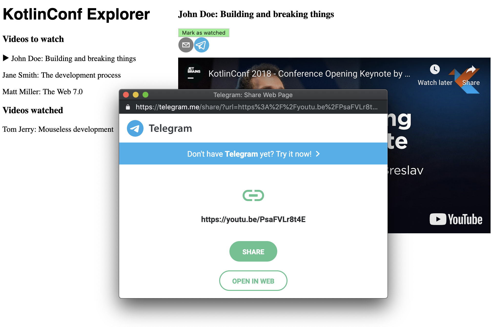

# Using packages from NPM

The app is already coming together nicely, but we're still missing some essential parts to make it really worth our user's while. But instead of writing everything from scratch ourselves, let's make use of the rich ecosystem surrounding React. There's a ton of ready-made components out there just waiting to be used, so let's not reinvent the wheel but use them to our advantage!

First up and probably the most obvious missing functionality is the video player.

### Adding the video player component

We need to replace our placeholder video component with one that can actually show the YouTube videos we're linking by adding in a ready-made video player for React. We'll use the `react-player` component to show the video and control the appearance of the player. We can take a look at some of the documentation for it and its API in the GitHub [README](https://github.com/CookPete/react-player/blob/master/README.md).

In the beginning, we have already added the `react-player` package to our Gradle build file. This was the responsible snippet:

```kotlin
dependencies {
    //...
    //Video Player (chapter 7)
    implementation(npm("react-player", "~2.6.0"))
    //...
}
```

You're seeing that right – NPM dependencies can be added to a Gradle build file via the `npm` function. The yarn installation managed by the Gradle plugin will take care of downloading, installing and updating those NPM dependencies for you.

Since we want to use this module from Kotlin, we need to tell our compiler what the component interface looks like – what kind of things are okay to invoke, to set, or to read from this external component, so that we remain safe, and can count on tool support. To do this, let's create a file called `ReactPlayer.kt`, with the following contents:

```kotlin
@file:JsModule("react-player")
@file:JsNonModule

import react.*

@JsName("default")
external val reactPlayer: RClass<dynamic>
```

Because JavaScript imports/exports isn't the simplest topic, it can sometimes be tricky to find the correct combination between annotations to get the Kotlin compiler on the same page as us. These last two lines are equivalent to a JavaScript import like `require("react-player").default;`. It tells the compiler that we're certain we'll get a component conforming to `RClass<dynamic>` at runtime.

#### Typed wrappers for the video player component

However, in this configuration, we're giving up a lot of the benefits that Kotlin gives us. The declaration of `dynamic` essentially tells the compiler to just accept whatever we give it, at the risk of breaking things at runtime (also commonly known as *in production*).

Fortunately, we know the structure of the interfaces used by the imported components (or can infer them rather quickly from the [README](https://github.com/CookPete/react-player#usage)), so making our wrappers typesafe is a rather straightforward task. We can define a typesafe external interface which allows us to set the URL as we see fit. And we modify the `ReactPlayer` definition accordingly:

```kotlin
//...
external val reactPlayer: RClass<ReactPlayerProps>

external interface ReactPlayerProps : RProps {
    var url: String
}
```

Within our `VideoPlayer` class, it is finally time to replace the boring gray rectangle with some actual, moving images! We remove the `img` tag and replace it with

```kotlin
reactPlayer {
    attrs.url = props.video.videoUrl
}
```

### Adding social share buttons

As with most things, KotlinConf talks are best enjoyed together. An easy way to share the high-quality content we're going to have in our application with friends and colleagues would be to have some "share" buttons. Ideally, they would support messengers and email. Once more, we can use an off-the-shelf React component for this purpose, for example, [react-share](https://github.com/nygardk/react-share/blob/master/README.md), another package that we have already added with the corresponding snippet in our Gradle configuration:

```kotlin
dependencies {
    //...
    //Share Buttons (chapter 7)
    implementation(npm("react-share", "~4.2.1"))
    //...
}
```

Let's once more write some wrappers. When we look at the [examples on GitHub](https://github.com/nygardk/react-share/blob/master/demo/Demo.jsx#L61), we can see that a share button consists of two react components: `EmailShareButton` and `EmailIcon`, for example. However, all of them share (mostly) the same interface. We end up with a `ReactShare.kt` declaration which looks like this:

```kotlin
@file:JsModule("react-share")
@file:JsNonModule

import react.RClass
import react.RProps

@JsName("EmailIcon")
external val emailIcon: RClass<IconProps>

@JsName("EmailShareButton")
external val emailShareButton: RClass<ShareButtonProps>

@JsName("TelegramIcon")
external val telegramIcon: RClass<IconProps>

@JsName("TelegramShareButton")
external val telegramShareButton: RClass<ShareButtonProps>

external interface ShareButtonProps : RProps {
    var url: String
}

external interface IconProps : RProps {
    var size: Int
    var round: Boolean
}
```

Above our `reactPlayer` usage site in `VideoPlayer.kt`, let's add the two share buttons (in a `styledDiv` for a layout that is a bit nicer).

```kotlin
styledDiv {
    css {
        display = Display.flex
        marginBottom = 10.px
    }
    emailShareButton {
        attrs.url = props.video.videoUrl
        emailIcon {
            attrs.size = 32
            attrs.round = true
        }
    }
    telegramShareButton {
        attrs.url = props.video.videoUrl
        telegramIcon {
            attrs.size = 32
            attrs.round = true
        }
    }
}
```

We can now validate that the buttons actually work by clicking one of them and seeing if the corresponding *share window* opens. If you don’t see anything, you may need to disable your social / ad blocker for it to work.



Feel free to repeat this step with some of the other share buttons [offered by the component](https://github.com/nygardk/react-share/blob/master/README.md#features).

You can find the state of the project after this section on the `step-06-packages-from-npm` branch in the [GitHub](https://github.com/kotlin-hands-on/web-app-react-kotlin-js-gradle/tree/step-06-packages-from-npm) repository.
