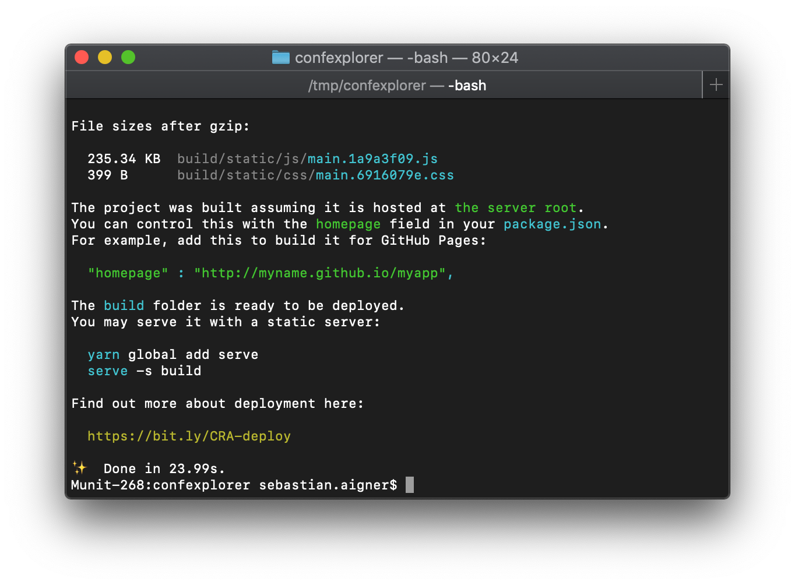

# Deploying to production and the cloud

After the hard work of building the application is done, it's time to get it published for people to see and use!

### Packaging a production build

To package all of our assets in production mode, invoke yarn run build. Your application will be packaged and assembled into the `build` folder in the root of your project. This can take a while, as various optimizations are run on your project.



After the short wait is over, we'll be greeted by a number of static files inside the `build` folder that are ready for deployment. You can put them on a static HTTP server of your choice, serve them using GitHub Pages, or host them on a cloud provider of your choice.

### Deploying to Heroku

Heroku makes it quite simple to spin up an application that is reachable under its own domain. Their free tier should be enough for development purposes and for showing off to a few of your friends and coworkers!

After successfully [creating an account](https://signup.heroku.com/), [installing and authenticating the CLI client](https://devcenter.heroku.com/articles/heroku-cli), we can create a git repository and attach a Heroku app by running the following on the command line while in our project root:

```
git init
heroku create
git add .
git commit -m "initial commit"
```

Unlike a regular React app, our production build process (which is run on Heroku) requires a JVM to be present on the compiling system. So let's add the corresponding buildpack!

```
heroku buildpacks:add -i 1 https://github.com/heroku/heroku-buildpack-jvm-common.git
```

To enable our React application to be served properly, we can use [existing buildpacks](https://github.com/mars/create-react-app-buildpack) for this type of application.

```
heroku buildpacks:add https://github.com/mars/create-react-app-buildpack.git
```

We can now trigger a deployment, for example by running the following command:

```
git push heroku master
```

If everything has gone according to plan, we'll be able to see our application on the world wide web now!

