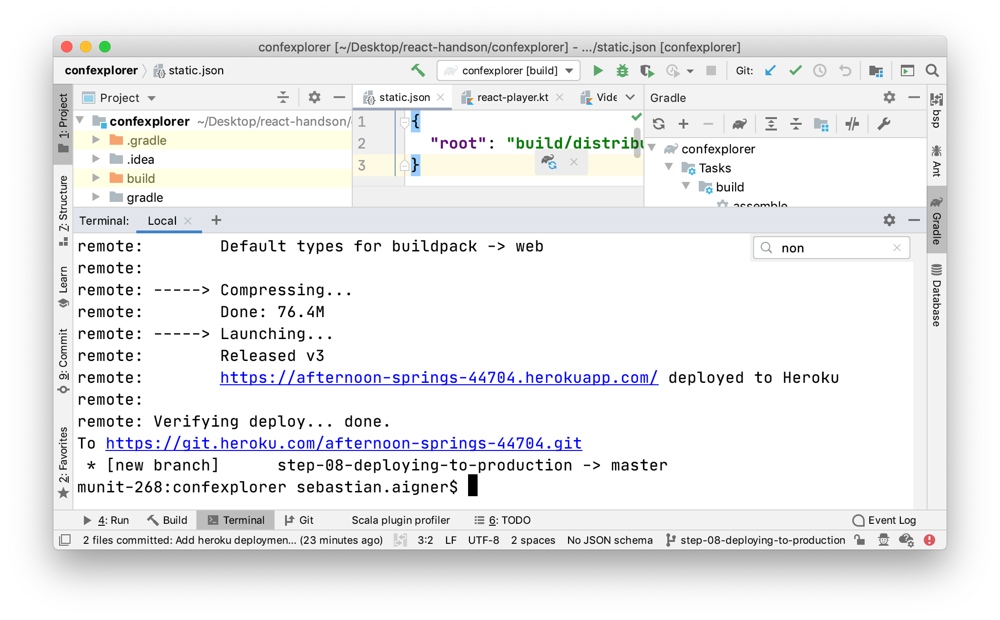

# Deploying to production and the cloud

After the hard work of building the application is done, it's time to get it published for people to see and use!

### Packaging a production build

To package all of our assets in production mode, it is enough to run the `build` task in Gradle via the tool window in IntelliJ IDEA or by running `./gradlew build`.  This generates an optimized build of your project, applying various impovements such as DCE (dead code elimination).

After the short wait is over, we'll be greeted by a number of static files inside the `/build/distributions` folder that are ready for deployment. They include the JS files, HTML files and other resources required to run our application. You can put them on a static HTTP server of your choice, serve them using GitHub Pages, or host them on a cloud provider of your choice.

### Deploying to Heroku

Heroku makes it quite simple to spin up an application that is reachable under its own domain. Their free tier should be enough for development purposes and for showing off to a few of your friends and coworkers!

After successfully [creating an account](https://signup.heroku.com/), [installing and authenticating the CLI client](https://devcenter.heroku.com/articles/heroku-cli), we can create a git repository and attach a Heroku app by running the following commands in the Terminal while in our project root:

```bash
git init
heroku create
git add .
git commit -m "initial commit"
```

Unlike a regular JVM application that would run on Heroku (for example written with Ktor or Spring Boot), our app generates static HTML pages and JS files that need to be served accordingly. We can adjust the required buildpacks to properly serve our program.

```bash
heroku buildpacks:set heroku/gradle
heroku buildpacks:add https://github.com/heroku/heroku-buildpack-static.git
```

To allow the `heroku/gradle` buildpack to run properly, a `stage` task needs to be present in our Gradle build file. Luckily, it is equivalent to our `build` task, so the changes we have to make at the bottom of our `build.gradle.kts` file are very limited:

```kotlin
// Heroku Deployment (chapter 9)
tasks.register("stage") {
    dependsOn("build")
}
```

We configure the `buildpack-static` by adding a file called `static.json` to the root of our project. We add the `root` property inside the file as follows:

```xml
{
    "root": "build/distributions"
}
```

We can now trigger a deployment, for example by running the following command:

```bash
git add -A
git commit -m "add stage task and static content root configuration"
git push heroku master
```

```note
If you're pushing from a non-master branch (such as the `step` branches from the example repository), you need to adjust the command to push to the `master` remote. (such as `git push heroku step-08-deploying-to-production:master`)
```

If everything has gone according to plan, we will see the URL under which we can reach our application on the world wide web now!



You can find the state of the project after this section on the `step-08-deploying-to-production` branch in the [GitHub](https://github.com/kotlin-hands-on/web-app-react-kotlin-js-gradle/tree/step-08-deploying-to-production) repository.
