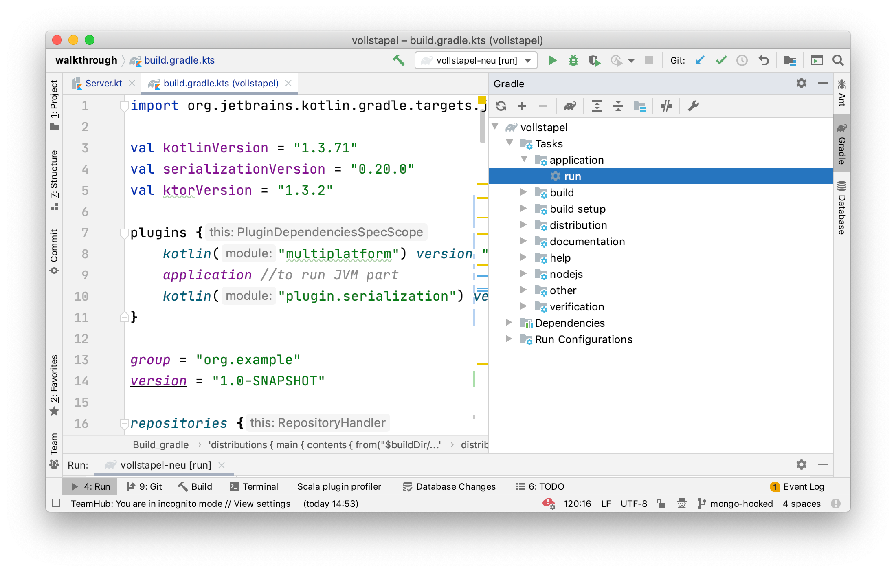
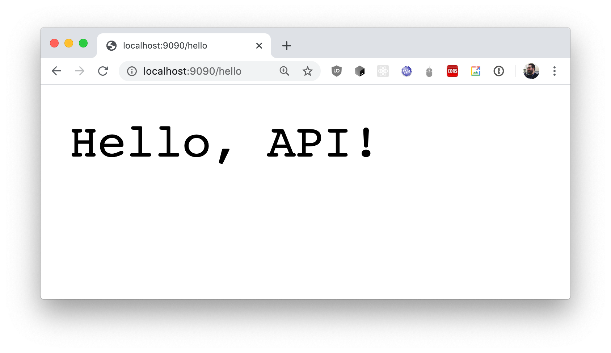
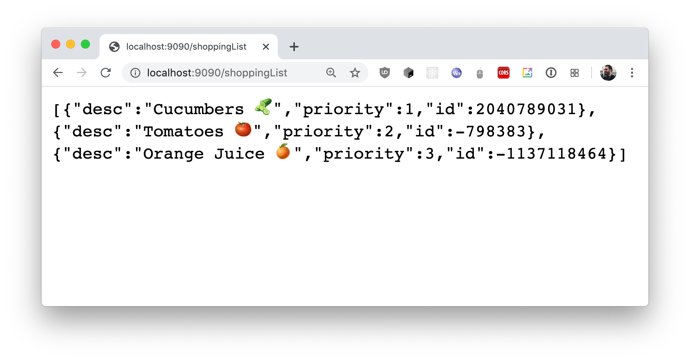
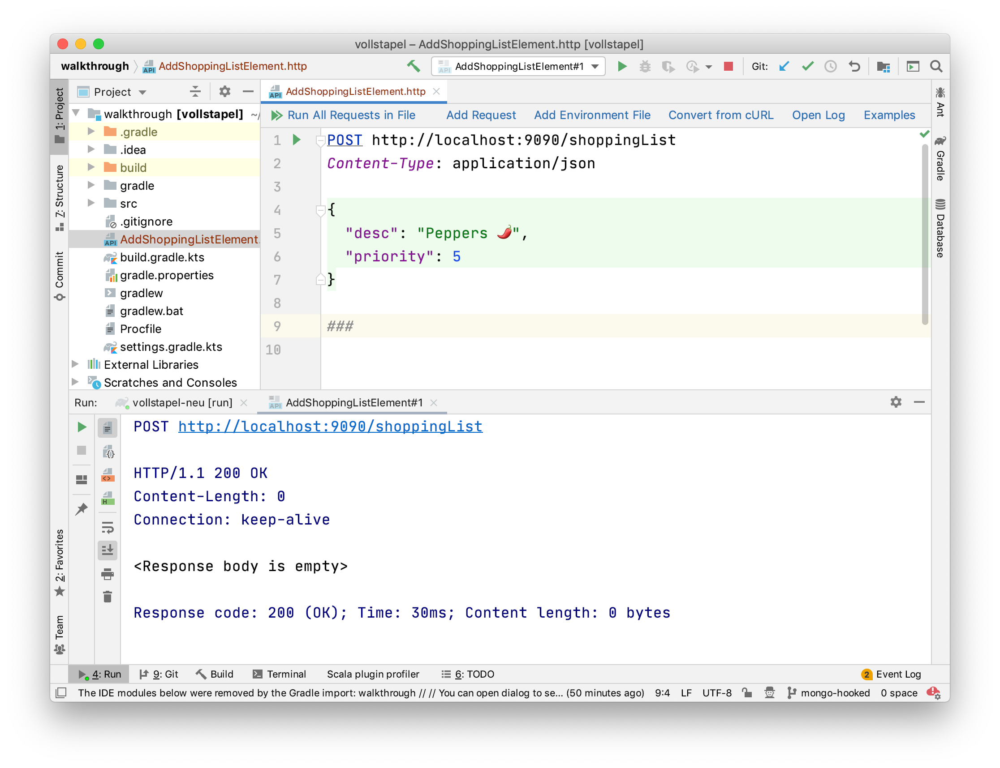

# A simple API server

We begin by writing the server side of our application. The typical simple API server implements the [CRUD operations](https://en.wikipedia.org/wiki/Create,_read,_update_and_delete) – Create, Read, Update and Delete. For our simple shopping list, we can actually constrain us even more, and focus solely on

- creating new entries in our list,

- reading entries via the API, and

- deleting entries once we are done with them.

We're building a *CRD* app, so to say.

In this hands-on, we'll be building our backend using ktor – a framework for building asynchronous servers and clients in connected systems in Kotlin. It requires little ceremony to set up, but can grow as systems become more complex, which makes it a good choice for our project.

You can find out more information about ktor in the related hands-on tutorials on this website, and check out the documentation on [ktor.io](https://ktor.io/).

### Running the embedded server

Instantiating a server with ktor can be done in just a few lines. We simply tell the [embedded server](https://ktor.io/docs/create-server.html#embedded-server) that ships with ktor to use the `Netty` engine on a port of our choice, in our case `9090`. Let's define our entry point in `src/jvmMain/kotlin/Server.kt`. We also add all imports we need for the rest of this hands-on, so that we won't have to worry about them later:

```kotlin
import io.ktor.application.*
import io.ktor.features.*
import io.ktor.http.*
import io.ktor.http.content.*
import io.ktor.request.*
import io.ktor.response.*
import io.ktor.routing.*
import io.ktor.serialization.*
import io.ktor.server.engine.*
import io.ktor.server.netty.*
import org.litote.kmongo.*
import org.litote.kmongo.coroutine.*
import org.litote.kmongo.reactivestreams.KMongo
import com.mongodb.ConnectionString

fun main() {
    embeddedServer(Netty, 9090) {
        routing {
            get("/hello") {
                call.respondText("Hello, API!")
            }
        }
    }.start(wait = true)
}
```

Just like that, we can serve our first API endpoint – by specifying the HTTP method (`GET`) and the route under which it should be reachable (`/hello`)! To start our application and see that everything works as we would expect it to, we execute the Gradle run task. We can do this from the command line via `./gradlew run`. If we're working with IntelliJ IDEA, we can also choose the run task from the Gradle tool window:



Once the application has finished compiling and the server has started up, we can use a web browser to navigate to [`http://localhost:9090/hello`](http://localhost:9090/hello), and see our first route in action!



Just like we have defined the endpoint for GET requests to `/hello` here, we will be able to configure all endpoints for our API inside the [routing](https://ktor.io/docs/routing-in-ktor.html) block. But before we continue with designing our application, let's get a little bit of ceremony out of the way by installing the required _features_ to our embedded servers.

### Installing ktor features

[Features](https://ktor.io/docs/features.html) are something ktor provides that enable support for certain functionality, such as encoding, compression, logging, authentication, among others. While the implementation details of ktor features (acting as interceptors / middleware providing extra functionality) aren't relevant for this tutorial, we will use three of these _features_ in our application, by adding the following lines to the top of our `embeddedServer` block in `src/jvmMain/kotlin/Server.kt`:

```kotlin
install(ContentNegotiation) {
    json()
}
install(CORS) {
    method(HttpMethod.Get)
    method(HttpMethod.Post)
    method(HttpMethod.Delete)
    anyHost()
}
install(Compression) {
    gzip()
}

// . . .
```

Each call to `install` adds one feature to our ktor application:

- [`ContentNegotiation`](https://ktor.io/docs/serialization.html) provides the automatic content conversion of requests based on their`Content-Type` and `Accept` headers. Together with the `json()` setting, this enables automatic serialization and deserialization using the JSON format – allowing us to delegate this tedious task to the framework.
- [`CORS`](https://ktor.io/docs/cors.html) configures [Cross-Origin Resource Sharing](https://developer.mozilla.org/en-US/docs/Web/HTTP/CORS), which will allow us later to make calls from arbitrary JavaScript clients, and helps us prevent issues down the line.
- [`Compression`](https://ktor.io/docs/compression.html) greatly reduces the amount of data that's needed to be sent to the client by `gzip`ping outgoing content when applicable.

This configuration is well-suited for our type of project, which means we can move on to create our common model – the representation of our shopping list items we want to expose.

### A shopping list item data model

At this point, we already start benefitting from using Kotlin multiplatform projects: We can define our data model once as a common abstraction, and refer to it from both the backend *and* the frontend. With a little bit of foresight (in regard to how our database will be structured later), we can deduce a simple model for our `ShoppingListItem`. It is characterized by

- a textual description of our item,
- a numeric priority for our item, and
- an identifier

Let's turn this into Kotlin code, and create a file called `src/commonMain/kotlin/ShoppingListItem.kt` with the following content:

```kotlin
import kotlinx.serialization.Serializable

@Serializable
data class ShoppingListItem(val desc: String, val priority: Int) {
    val id: Int = desc.hashCode()

    companion object {
        const val path = "/shoppingList"
    }
}
```

The `@Serializable` annotation is available in this common code as well, thanks to our use of `kotlinx.serialization`, which integrates tightly with multiplatform projects, and works well even with `data` classes.

Once we use this serializable `ShoppingListItem` class from the JVM and JS platforms, the proper code will be generated for each platform that takes care of serialization and deserialization, without us having to do any extra work. Neat, right?

We use the `companion object` to store some additional information about our model – in this case, the `path` under which we will be able to access it in our API. By referring to this variable instead of defining our routes and requests as strings, we get a big benefit: If at a later time we decide to change the `path` to our model operations, we only need to do it here, and can have client and server adjust automatically. It also saves us from making typos in this part of the URL!

#### A note on generating an `id`

As you can see, this sample computes a _very_ simple `id` from the `hashCode()` of its description. This is enough for our toy example, but certainly an **oversimplification** for working with real data. If you are working with real data, it would be preferable to include tried and tested mechanisms to generate identifiers for your objects – from UUIDs to autoincrementing IDs backed by the database of your choice.

### A small (ephemeral) item store

We now use our  `ShoppingListItem` model to instantiate some example items, and keep track of any additions or deletions made through the API.

Because we currently don't have a database setup (something we still take care of in a later chapter), let's create a temporary storage for the `ShoppingListItem`s – a `MutableList` will do nicely. We can create it as a file-level declaration in `src/jvmMain/kotlin/Server.kt`:

```kotlin
val shoppingList = mutableListOf(
    ShoppingListItem("Cucumbers 🥒", 1),
    ShoppingListItem("Tomatoes 🍅", 2),
    ShoppingListItem("Orange Juice 🍊", 3)
)
```

As we can see, we can refer to `common` classes just like we would refer to any other class in Kotlin – they are shared between all of our targets, after all.

Now that we have some information that we'd like to serve and mutate, it's finally time to expose those operations to clients via HTTP!

### Creating routes for the JSON API

Let's add the routes that support the creation, retrieval, and deletion of `ShoppingListItem`s. Inside `/src/jvmMain/kotlin/Server.kt`, we change our `routing` block to look as follows:

```kotlin
routing {
    route(ShoppingListItem.path) {
        get {
            call.respond(shoppingList)
        }
        post {
            shoppingList += call.receive<ShoppingListItem>()
            call.respond(HttpStatusCode.OK)
        }
        delete("/{id}") {
            val id = call.parameters["id"]?.toInt() ?: error("Invalid delete request")
            shoppingList.removeIf { it.id == id }
            call.respond(HttpStatusCode.OK)
        }
    }
}
```

As you can see, we can even group our routes based on a common path – and because we thought ahead, we don't even have to specify the `route` path as a String, but can use the `path` from our `ShoppingListItem` model. The code behaves predictably:

- A GET request to our model's path (`/shoppingList`) will respond with the whole shopping list
- A POST request to our model's path (`/shoppingList`) will add an entry to the shopping list.
- A DELETE request to our model's path and provided an `id`  (`shoppingList/47`) will remove an entry from the shopping list.

Something worth noting is that we can receive objects directly from requests, and also respond to requests with objects (and even lists of objects) directly. Thanks to setting up `ContentNegotiation` with `json()` support beforehand, our objects marked as `@Serializable` are automatically turned into JSON before being sent (in the case of a GET request) or received (in the case of a POST request).

To validate that everything works well, let's restart our application, head over to http://localhost:9090/shoppingList and validate that our data is properly served. If everything went well, we should see our example items in JSON formatting:



We can also test the POST and DELETE requests – although this is not quite as easy from the browser. We could wait until we implement our client in the next chapters, and see if everything works properly. Alternatively, we could use an HTTP client that has support for `.http` files. If you're using *IntelliJ IDEA Ultimate Edition*, for example, you can do this right from the IDE.

Create a file called `AddShoppingListElement.http` and add the declaration of the HTTP POST request as follows:

```http
POST http://localhost:9090/shoppingList
Content-Type: application/json

{
  "desc": "Peppers 🌶",
  "priority": 5
}
```

With our server running, execute the request via the run button in the gutter. If everything goes well, the "run" window should show `HTTP/1.1 200 OK`, and we can visit http://localhost:9090/shoppingList again to validate that our entry has been added properly:



We can repeat this process for a file called `RemoveShoppingListElement.http`, which contains the following:

```http
DELETE http://localhost:9090/shoppingList/AN_ID_GOES_HERE
```

We can try this request just as we did with the POST request – we just shouldn't forget replacing `AN_ID_GOES_HERE` with an existing ID.

Now that we have a backend that is able to support all operations that we need for a functional shopping list, we can turn to building a JavaScript frontend for our application, which will allow users to easily inspect, add, and tick off elements from their shopping list.

#### Related Gradle configuration

The artifacts required to use ktor are a part of the `jvmMain` `dependencies` block in our `build.gradle.kts` file, and include the server, logging, and supporting libraries for providing typesafe serialization support through `kotlinx.serialization`.

```kotlin
val jvmMain by getting {
    dependencies {
        implementation("io.ktor:ktor-serialization:$ktorVersion")
        implementation("io.ktor:ktor-server-core:$ktorVersion")
        implementation("io.ktor:ktor-server-netty:$ktorVersion")
        implementation("ch.qos.logback:logback-classic:1.2.3")
        implementation("io.ktor:ktor-websockets:$ktorVersion")
        implementation("org.litote.kmongo:kmongo-coroutine-serialization:4.1.1")
    }
}
```

`kotlinx.serialization` and its integration with ktor also requires a few common artifacts to be present, which we can find in the `commonMain` source set:

```kotlin
val commonMain by getting {
    dependencies {
        implementation(kotlin("stdlib-common"))
        implementation("org.jetbrains.kotlinx:kotlinx-serialization-core:$serializationVersion")
        implementation("io.ktor:ktor-client-core:$ktorVersion")
    }
}
```