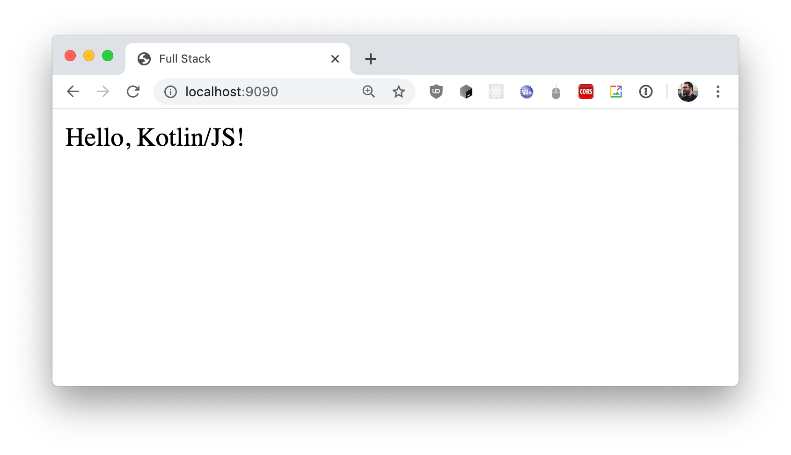
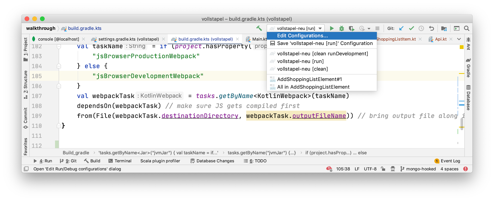
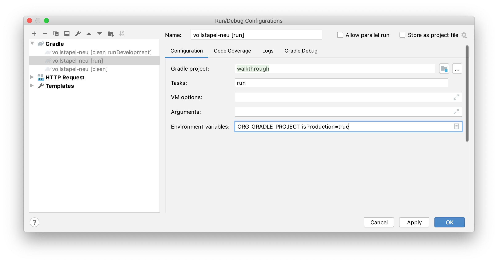

# Frontend setup

At this point, we have successfully built the server side of our application! Now, it is time to make it human-usable. For this, we want to build a small application written in Kotlin/JS that can load the JSON responses from the server, display them in the shape of a list, as well as allow the user to add and remove elements to this list.

### Prerequisites

#### Serving the frontend

By default and without explicit other configuration, a multiplatform project only means that we can build our application once for the JVM, and once for JavaScript, independently. However, for our application to function properly, we need to have both the backend and the frontend compiled. In fact, we want the backend we built to also serve all the assets required to view the frontend – an HTML page and a web application packaged as a `.js` file.

**In our template project, the adjustments to the Gradle file are already made:** Whenever we run our server with the `run` Gradle task, our frontend also gets built and is also included in the resulting artifacts. If you'd like to learn more about how this works, or would like to understand it for use in other projects, refer to the "Relevant Gradle configuration" section. 

The template also already adds a boilerplate `index.html` file to the `src/commonMain/resources` folder. It doesn't need to contain a lot: a `root` node for rendering our components (as discussed in the following chapter), and a `script` tag that includes our application. It looks like this:

```xml
<!DOCTYPE html>
<html lang="en">
<head>
    <meta charset="UTF-8">
    <title>Full Stack App!</title>
</head>
<body>
<div id="root"></div>
<script src="shoppinglist.js"></script>
</body>
</html>
```

It might not be immediately obvious why this file is placed in the `common` resources as opposed to a `jvm` source set. This way, if we ever need to run only the browser application without the backend, the tasks for running the JS application in the browser (`jsBrowserDevelopmentRun` and `jsBrowserProductionRun`) will have access to the file as well.

While we don't need to do anything to make sure the file is properly available on the server, we still need to instruct ktor to provide these `.html` and `.js` files to a browser when requested.

#### Serving HTML and JavaScript files from ktor

For simplicity's sake, we will serve the `index.html` file on the root route `/`, and expose our JavaScript artifact in the root directory, as well. To tell ktor to do this, we add the corresponding routes in `src/jvmMain/kotlin/Server.kt` to our `routing` block:

```kotlin
get("/") {
    call.respondText(
        this::class.java.classLoader.getResource("index.html")!!.readText(),
        ContentType.Text.Html
    )
}
static("/") {
    resources("")
}
```

To confirm that everything went as planned, we can run our application again via the Gradle `run` task. Upon navigating to `http://localhost:9090/`, we should now see a page saying "Hello, Kotlin/JS", signaling that our script code is working properly – and that it is time for us to replace it with some proper user interface code!



#### A word on optimization: `development` and `production` modes for Kotlin/JS

While we are developing, our build system generates `development` artifacts. This means that no optimizations are applied when our Kotlin code gets turned into JavaScript. We profit from improved compile times at the expense of a larger JS file. Once we deploy our application to the web, this is something we want to avoid.

To instruct Gradle to generate optimized production assets, we set the environment variable `ORG_GRADLE_PROJECT_isProduction=true`. If we are running our application on some kind of deployment system, we can configure it to set this environment variable during the build. If we want to try out production mode locally, we can do so via the terminal, or by adding the variable to the run configuration in IntelliJ IDEA, via the "Edit Configurations..." action:



In the "Run/Debug Configurations" menu, we can now set the environment variable:



Subsequent builds with this run configuration will perform all optimizations available for the frontend part of our application, including dead code elimination, but will be slower than development builds – so while we are developing, it would be a good idea to remove this flag again.

### Relevant Gradle configuration

The Gradle configuration for our application contains a snippet that binds the execution and packaging of our server-side JVM application to depend on the build of our frontend application, respecting the settings regarding `development` and `production` from the environment variable. It makes sure that whenever a `jar` file is built from our application, it includes our Kotlin/JS code:

```kotlin
tasks.getByName<Jar>("jvmJar") {
    val taskName = if (project.hasProperty("isProduction")) {
        "jsBrowserProductionWebpack"
    } else {
        "jsBrowserDevelopmentWebpack"
    }
    val webpackTask = tasks.getByName<KotlinWebpack>(taskName)
    dependsOn(webpackTask) // make sure JS gets compiled first
    from(File(webpackTask.destinationDirectory, webpackTask.outputFileName)) // bring output file along into the JAR
}
```

The `jvmJar` task is specifically chosen because it is called by the `application` plugin (responsible for the `run` task), but also the `distributions` plugin, which is responsible for the `installDist` task (amongst others). This means that the combined build will work when we `run` our application, and also when we prepare it for deployment, e.g. on a cloud platform.

To ensure that the `run` task properly recognizes the JS artifacts, its classpath is also adjusted:

```kotlin
tasks.getByName<JavaExec>("run") {
    classpath(tasks.getByName<Jar>("jvmJar")) // so that the JS artifacts generated by `jvmJar` can be found and served
}
```