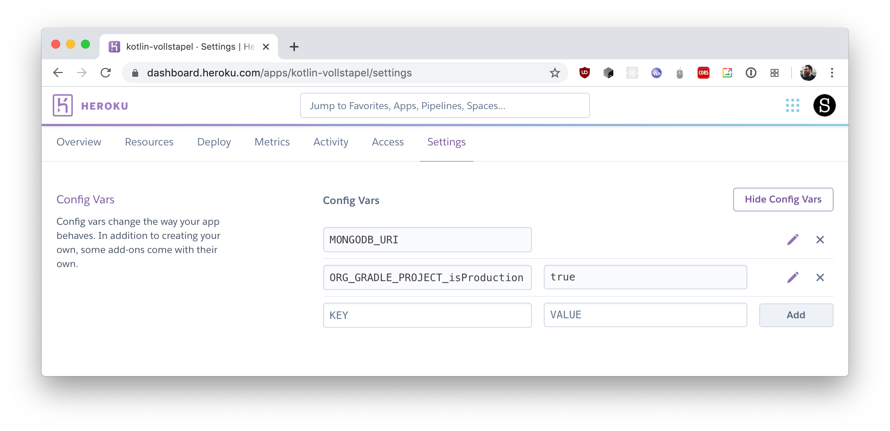

# Deploying to the cloud

In order to get our application running "in the cloud", we need to integrate our application with the environment variables provided by our platform, and add any other required configuration to our project. In this chapter, we'll explore what is necessary to deploy our app to the PaaS provider [Heroku](http://heroku.com/). Heroku makes it quite simple to spin up an application that is reachable under its own domain. Their free tier should be enough for development purposes and for showing off to a few of your friends and coworkers.

### Heroku setup

#### Creating an application

After successfully [creating an account](https://signup.heroku.com/), [installing and authenticating the CLI client](https://devcenter.heroku.com/articles/heroku-cli), we can create a Heroku app by running the following commands in the Terminal while in our project root:

```bash
heroku create
```

This adds another git remote to our project called `heroku`. Pushing to it will allow us to run the application in the cloud – provided we have configured it correctly. For this, we need to make sure that we have a database available, and that we respect platform settings such as environment variables. Let's go ahead and configure our app properly, starting with the provisioning of a MongoDB instance.

#### Provisioning a MongoDB instance

We will use one of the free providers for MongoDB instances on Heroku – mLab. Their "Sandbox" tier allows us to store up to ~500 MiB of data in our database – more than we could ever hope to add to our shopping list. To provision an instance for our application, we click "Install mLab MongoDB" on the [Heroku Elements](https://elements.heroku.com/addons/mongolab) page, and select our application.


#### The PORT variable

When running the application on Heroku, the cloud platform determines the port on which the application should be ran. If present, we can respect this setting by configuring our `embeddedServer` in `src/jvmMain/kotlin/Server.kt` like this:

```kotlin
fun main() {
    val port = System.getenv("PORT")?.toInt() ?: 9090
    embeddedServer(Netty, port) {
    // . . .
```

#### The MONGODB_URI variable

The mLab MongoDB instance that we have provisioned for our application exposes a `MONGODB_URI` String, which we use to connect our KMongo client to the cloud database. Because of the way mLab MongoDB is configured by default, we need to append the `retryWrites=false` parameter to our connection string, as well. To properly wire up these requirements, we instantiate our `client` and `database` variables in `src/jvmMain/kotlin/Server.kt` like so:

```kotlin
val connectionString: ConnectionString? = System.getenv("MONGODB_URI")?.let {
    ConnectionString("$it?retryWrites=false")
}

val client = if (connectionString != null) KMongo.createClient(connectionString) else KMongo.createClient()
val database = client.getDatabase(connectionString?.database ?: "shoppingList")
```

This ensures that whenever our environment variables are set, we create our `client` based on this information. Otherwise (e.g. on localhost), we instantiate our database connection just as we did previously.

#### The Procfile

The Procfile essentially defines the "entry point" for our Heroku application. To get Heroku to properly start our application, we add a `Procfile` to the root directory of our project, and point it to the startup script that is generated by our `stage` task, which is already included in our Gradle template:

```
web: ./build/install/vollstapel/bin/vollstapel
```

#### Turning on production mode

To turn on compilation with optimizations for our Gradle assets, we need to pass another flag to our build process: `ORG_GRADLE_PROJECT_isProduction` should be set to `true`. When we're deploying on Heroku, we can set this evironment variable through the webinterface. For our application under "Settings", select "Reveal Config Vars", and set the config var:



#### Deploy & done!

We can now trigger a deployment, for example by running the following command:

```bash
git commit -m "prepare app for cloud deployment"
git push heroku master
```

```note
If you're pushing from a non-master branch (such as the `step` branches from the example repository), you need to adjust the command to push to the `master` remote. (such as `git push heroku step-08-deploying-to-production:master`)
```

If everything has gone according to plan, we will see the URL under which we can reach our application on the world wide web now!

**You can also find the finished application on GitHub on the [`final` branch](https://github.com/kotlin-hands-on/jvm-js-fullstack/tree/final).**

At this point, it's time we move on without further guidance – but that doesn't mean we should stop experimenting! Check out the "What's next" section to find some inspiration for what else could be done with the project.

### Relevant Gradle configuration

The `stage` task as an alias for `installDist`:

```kotlin
// Alias "installDist" as "stage" for Heroku
tasks.create("stage") {
    dependsOn(tasks.getByName("installDist"))
}

// only necessary until https://youtrack.jetbrains.com/issue/KT-37964 is resolved
distributions {
    main {
        contents {
            from("$buildDir/libs") {
                rename("${rootProject.name}-jvm", rootProject.name)
                into("lib")
            }
        }
    }
}
```