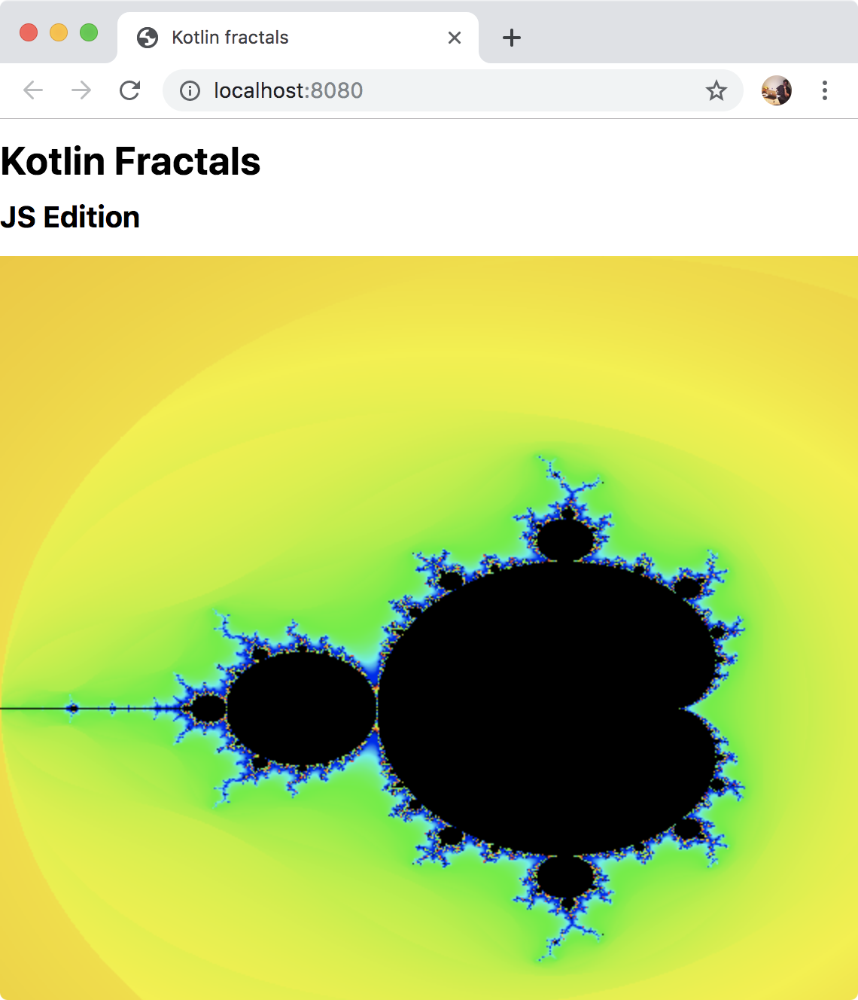

# Creating JavaScript Target

We've tried calling different URLs from the JVM backend to see
different [Mandelbrot Set](https://en.wikipedia.org/wiki/Mandelbrot_set)
images, like this one


It is hard to deal with the 2D space coordinates manually,
and our goal is to create a more user-friendly HTML interface
for this. 

We'll make the client-side JavaScript application entirely with Kotlin/JS. Our first step
is to add an HTML page with a couple of lines of Kotlin using the 
[kotlinx.html](https://github.com/Kotlin/kotlinx.html) library.


```note
We are using an experimental Kotlin Multiplatform Gradle plugin
with experimental Kotlin/JS support. It
is currently not fully supported for running on a Windows operating system. 
The [Windows Subsystem for Linux(WSL)](https://en.wikipedia.org/wiki/Windows_Subsystem_for_Linux)
or Docker can be used as workarounds.
```

## Adding Gradle Target

We need to add a `js()` target to the `build.gradle.kts` file
in the `kotlin{..}` block. The resulting block should look like this

```kotlin
kotlin {
  jvm()
  js {
    browser()
  }
}
```

## Adding Kotlin/JS Dependencies

Now we can add Kotlin/JS dependencies to the project by
adding the following code to the `build.gradle.kts` project file:

```kotlin
kotlin.sourceSets["jsMain"].dependencies {
  implementation(kotlin("stdlib-js"))
  implementation("org.jetbrains.kotlinx:kotlinx-html-js:0.6.12")
}
```

We've now added a dependency to the Kotlin standard library and
an HTML DSL library to our Kotlin/JS source set.

We should refresh the Gradle project model to make sure
the IDE sees all our project model changes. Let's click on the _refresh_
icon in the Gradle tab to accomplish this.

## Adding index.html

The next step is to add the `index.html`
to the project. Let's create the 
`src/jsMain/resources/index.html` file in our project
with the following contents
```html
<html lang="en">
<body>
  <div id="app">Loading...</div>
  <script src="kotlin-fractals2-handson.js"></script>
</body>
</html>
```
We can add CSS to the HTML file to make the page look better in the browser.
You can have a look at the 'step-003' branch of the
[github.com/kotlin-hands-on/intro-mpp](https://github.com/kotlin-hands-on/intro-mpp)
repository for more on this.

## Rendering HTML from Kotlin/JS

Let's render a basic HTML using the
[kotlinx.html](https://github.com/Kotlin/kotlinx.html) library.
We can refer to the
[Type-Safe Builders](https://kotlinlang.org/docs/reference/type-safe-builders.html)
article for an explanation of Type-Safe builders in Kotlin.

Next we have to add a `src/jsMain/kotlin/com/jetbrains/handson/introMpp/main.kt` file
with the following contents

```kotlin
import kotlinx.html.dom.append
import kotlinx.html.js.*
import kotlin.browser.document

const val jvmBackend = "http://127.0.0.1:8888"

fun main() {
  document.getElementById("app")
          ?.also { it.innerHTML = "" }
          ?.append {
            h1 { +"Kotlin Fractals" }
            h2 { +"JS Edition" }
            img(src = "$jvmBackend/mandelbrot")
          }
}
```

## Running the App

Now it's time to start both the server-side JVM process,
by running the `run` task in Gradle, and the client-side
part by running the `jsRun` task (please note, it may
not work on Windows due to a known bug). Both of these Gradle tasks
will run servers for us (a [Ktor](https://ktor.io/) server for the JVM, and a
webpack dev server for the JS), we don't expect these tasks
to complete. Terminating these tasks will stop the dev servers.

We may run two processes in the console: 

* `./gradlew run` and `./gradlew jsRun` for macOS and Linux
*  `gradlew.bat run` and `./gradlew.bat jsRun` for Windows

or execute these tasks [from an IDE](https://www.jetbrains.com/help/idea/work-with-gradle-tasks.html). 

If all goes well, we should be able to see something
like this in the web browser:




## Completed Code

We can use the `step-003` branch of the
[github.com/kotlin-hands-on/intro-mpp](https://github.com/kotlin-hands-on/intro-mpp)
repository as a solution for the tasks that we did above. 
We can also download the
[archive](https://github.com/kotlin-hands-on/intro-mpp/archive/step-003.zip)
from GitHub directly.
