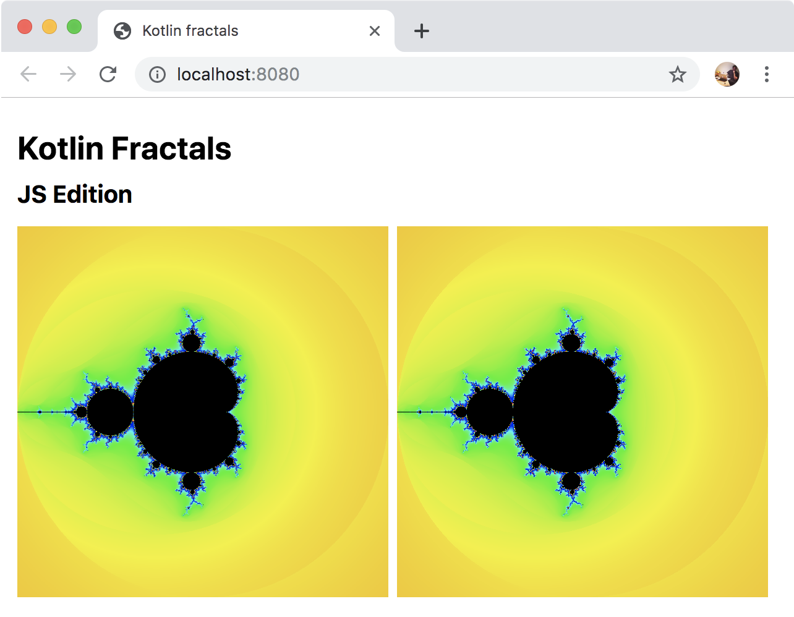

# Common Rendering and JS

Now we are ready to update our Kotlin/JS code to provide 
`actual` declarations for all the `expect` declarations from the `commonMain`. 
We will be using the [HTML Canvas](https://www.w3schools.com/html/html5_canvas.asp)
on the client-side to render the images.

## Adding Colors

The actual `Color` class for the client-side can be implemented from scratch.
Let's create a `color-actual.kt` file in the `src/jsMain/kotlin/com/jetbrains/handson/introMpp` folder
with the following contents:

```kotlin
actual class Color(
        val r: Int,
        val g: Int,
        val b: Int
)
actual fun Colors.newColor(r: Int, g: Int, b: Int) = Color(r, g, b)
actual val Colors.BLACK: Color get() = Color(0, 0, 0)
```

We've also added the `actual` declarations for the `Colors.BLACK` property
and for the `Colors.newColor` function.
That should be enough to fix the compilation of the `jsMain` source set. Now it is
time to support rendering to HTML Canvas

## Adding Canvas Support

Let's add the implementation code to render images into the HTML Canvas. We'll need
to create the `src/jsMain/kotlin/com/jetbrains/handson/introMpp/canvas.kt` file with the following contents

```kotlin
fun renderToCanvas(canvas : HTMLCanvasElement, action: (FractalImage) -> Unit) {
  val ctx = canvas.getContext("2d") as CanvasRenderingContext2D
  ctx.clearRect(0.0, 0.0, ctx.canvas.width.toDouble(), ctx.canvas.height.toDouble())

  val imageData = ctx.createImageData(
      ctx.canvas.width.toDouble(),
      ctx.canvas.height.toDouble())

  val image = object:FractalImage {
    override val pixelRect
      get() = Rect(
        left = 0, top = 0,
        right = imageData.width, bottom = imageData.height)

    override fun putPixel(p: Pixel, c: Color) {
      val base = 4 * (p.x + imageData.width * p.y)
      val image : dynamic = imageData.data
      image[base + 0] = c.r
      image[base + 1] = c.g
      image[base + 2] = c.b
      image[base + 3] = 255
    }
  }
  action(image)
  ctx.putImageData(imageData, 0.0, 0.0)
}
```

## Using the Canvas

The very last step is to call the rendering code from the `main.kt` file. 
Let's add a few more lines to the `src/jsMain/kotlin/com/jetbrains/handson/introMpp/main.kt` file so that 
the `main()` function adds a canvas element after the `img()` function call:

```kotlin
img//(...)
canvas {
  id = "canvas"
  width = "600"
  height = "600"
}
```

We also add the call to the rendering code at the end of the `main()` function:

```kotlin
renderToCanvas(document.getElementById("canvas") as HTMLCanvasElement) { image ->
  MandelbrotRender.justRender(300, image, MandelbrotRender.initialArea)
}
```

## Running the client-side App

It is now time to run the Gradle `run` task to start the server-side Kotlin/JVM project, and the
`jsRun` task to start the client-side Kotlin/JS application.
We may run two processes in the console:

* `./gradlew run` and `./gradlew jsRun` for macOS and Linux
*  `gradlew.bat run` and `./gradlew.bat jsRun` for Windows

or execute these tasks [from an IDE](https://www.jetbrains.com/help/idea/work-with-gradle-tasks.html). 
 
We should be
able to see two images – the one that is rendered server-side with the Kotlin/JVM, and a second
that is rendered directly in the browser with Kotlin/JS:




## Completed Code

We may use the `step-006` branch of the
[github.com/kotlin-hands-on/intro-kotlin-mutliplatform](https://github.com/kotlin-hands-on/intro-kotlin-mutliplatform/tree/step-006)
repository as the solution of the tasks that we done above. 
We may also just download the
[archive](https://github.com/kotlin-hands-on/intro-kotlin-mutliplatform/archive/step-006.zip)
from GitHub directly.
   
