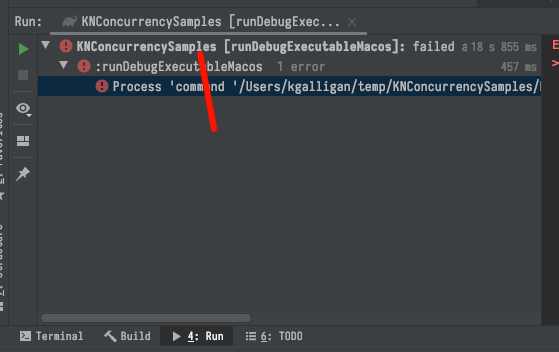

# Frozen State

In Kotlin/Native, all state is considered mutable unless it is frozen. Frozen state is a new concept for Kotlin, although it exists in some [other](https://developer.mozilla.org/en-US/docs/Web/JavaScript/Reference/Global_Objects/Object/freeze) [languages](https://apidock.com/ruby/Object/freeze). In Kotlin/Native, there is a function `freeze()` defined on all classes. When you call `freeze()`, that object and everything it touches is frozen and immutable.

Once frozen, state can be shared between threads, but it cannot be changed.

Look for "2) Frozen State" in the `SampleMain.kt`. Uncomment `freezeSomeState()` and run it (by "run it" from now on we mean run `runDebugExecutableNative` again).

```kotlin
fun freezeSomeState(){
    val sd = SomeData("Hello 🐶", 22)
    sd.freeze()

    println("Am I frozen? ${sd.isFrozen}")
}

data class SomeData(val s:String, val i:Int)
```

You should see

```
Am I frozen? true
```

Understand that calling `freeze()` will change an attribute of your state at runtime. There is a flag on every object in Kotlin/Native that says if it is frozen or not, and for `sd` we have just flipped that flag to true. As demonstrated above, you can check if some state is frozen be reading the `isFrozen` property.

Back in `SampleMain.kt`, comment out any other uncommented method, and uncomment `failChanges()`. Run again.

This function will fail with an exception. The output console in IntelliJ IDEA can be a little confusing to navigate. Make sure you click the top level to see the full output.



The failing code is as follows

```kotlin
fun failChanges(){
    val smd = SomeMutableData(3)
    smd.i++
    println("smd: $smd")

    smd.freeze()
    smd.i++
    println("smd: $smd") //We won't actually get here
}

data class SomeMutableData(var i:Int)
```

The output looks like this

```
smd: SomeMutableData(i=4)
Uncaught Kotlin exception: kotlin.native.concurrent.InvalidMutabilityException: mutation attempt of frozen sample.SomeMutableData@8b40c4b8
        at 0   KNConcurrencySamples.kexe  (yada yada)
        at 1   KNConcurrencySamples.kexe  (yada yada)
(etc)
```

Before we freeze the object `smd`, you can change the `var` value. After we freeze, if you try to change the value, it'll throw an exception. `InvalidMutabilityException`, to be precise.

`InvalidMutabilityException` is your new friend. It'll help you solve your potential concurrency issues.

When you see `InvalidMutabilityException`, it means you are attempting to change some state that has been frozen. You probably did not want this state to be frozen, so your job will be to figure out why, and more importantly *when*, it was frozen. Remember, when you freeze something, everything it touches is frozen.

Developers often find `InvalidMutabilityException` frustrating at first. However, with practice, finding the source of issues is straightforward. Also, once you've rearchitected code for safe concurrency, you'll start to see how potentially unsafe a lot of the JVM code is. Enforcing safe mutability is generally a good thing.

As a final example, it's important to understand that freezing an object means you'll also be freezing everything that object has a reference to. Run `freezeChildren()`. 

```kotlin
fun freezeChildren(){
    val dataWithReference = DataWithReference(SomeData("Hello 🐶", 22))
    dataWithReference.freeze()

    println("Am I frozen? ${dataWithReference.child.isFrozen}")
}

data class DataWithReference(val child:SomeData)
```

`DataWithReference` has a child property `val child:SomeData`. When you freeze the parent, the child is frozen. This will be important to understand when we start working with larger object graphs.
