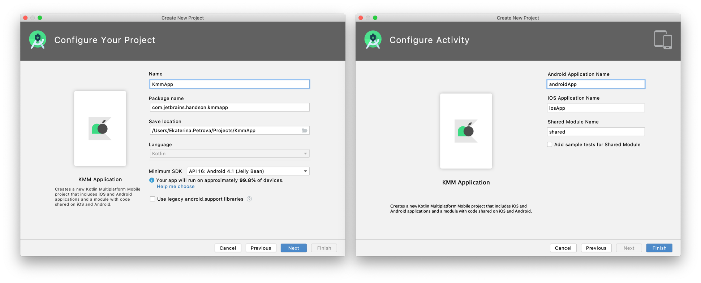

# Creating the KMM project

The KMM plugin for Android Studio includes a "New Kotlin Multiplatform Mobile Project" wizard. With this wizard, we will create the structure for our new project in just a few clicks.

In Android Studio, we first need to select **File** | **New** | **New Project** and select KMM Application in the list of project templates. Next, we need to specify a name for our new project. On the last step, we can keep the default names for the applications and shared module. Click finish and you’re all done!

To view the complete structure of our mobile multiplatform project, let's switch the view from Android to Project. 

You can explore the features [included in your project](https://helpserver.labs.jb.gg/help/kotlin-mobile/discover-kmm-project.html) and how to use them, or you can go directly to the next step and start coding!

Here's the [Git commit](https://github.com/kotlin-hands-on/kmm-networking-and-data-storage/commit/57964ab4f1243799dc84d3bbe2b97b8fd6ef8a14) with the KMM project created and configured. Now we are ready to start developing our multiplatform application.

