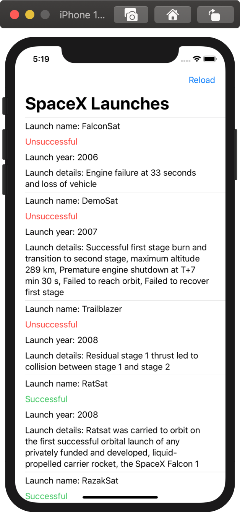

# Creating the iOS application

For the iOS part of our project, we will use SwiftUI to build the user interface and MVVM pattern to connect the UI to our KMM module, which contains all the business logic we need. Our KMM module is already connected to the iOS project — all the configuration we need was done by Android Studio plugin wizard. We can use it by simply importing it, just as we import regular iOS dependencies:

```swift
import shared 
```

 So all we need to do now is implement the SwiftUI views we need and fill them with the data.

## Implementing the UI: display the list of rocket launches

First, let's create a SwiftUI view for displaying an item from the list. To do this, we create a `RocketLaunchRow` SwiftUI view. It will be based on `HStack` and `VStack` views. We will provide extensions on the `RocketLaunchRow` structure with some useful helpers for displaying our data. To do this, in our Xcode project we create the new file with the type **SwiftUI View** named `RocketLaunchRow` and put the following in it:

```swift
import SwiftUI
import shared 

struct RocketLaunchRow: View {
    var rocketLaunch: RocketLaunch

    var body: some View {
        HStack() {
            VStack(alignment: .leading, spacing: 10.0) {
                Text("Launch name: \(rocketLaunch.missionName)")
                Text(launchText).foregroundColor(launchColor)
                Text("Launch year: \(String(rocketLaunch.launchYear))")
                Text("Launch details: \(rocketLaunch.details ?? "")")
            }
            Spacer()
        }
    }
}

extension RocketLaunchRow {
   private var launchText: String {
       if let isSuccess = rocketLaunch.launchSuccess {
           return isSuccess.boolValue ? "Successful" : "Unsuccessful"
       } else {
           return "No data"
       }
   }

   private var launchColor: Color {
       if let isSuccess = rocketLaunch.launchSuccess {
           return isSuccess.boolValue ? Color.green : Color.red
       } else {
           return Color.gray
       }
   }
}
```

We will display a list of the launches in the `ContentView`, which has been already created by the project wizard. Let's first create a ViewModel class for our `ContentView`, which will prepare and manage data for it. We declare it as an extension to the `ContentView`, as they are closely connected. Put the following in the `ContentView.swift`

```swift
// ...

extension ContentView {
    enum LoadableLaunches {
        case loading
        case result([RocketLaunch])
        case error(String)
    }

    class ViewModel: ObservableObject {
        @Published var launches = LoadableLaunches.loading
    }
}
```

To connect our view model (`ContentView.ViewModel`) with the view (`ContentView`) we will use **Combine**. We declare `ContentView.ViewModel` as an `ObservableObject` and use `@Published` wrapper for our `launches` property, so our view model will emit signals whenever this property changes. 

Now let's implement the body of the `ContentView` and display the list of launches.

```swift
struct ContentView: View {
  @ObservedObject private(set) var viewModel: ViewModel

    var body: some View {
        NavigationView {
            listView()
            .navigationBarTitle("SpaceX Launches")
            .navigationBarItems(trailing:
                Button("Reload") {
                    self.viewModel.loadLaunches(forceReload: true)
            })
        }
    }

    private func listView() -> AnyView {
        switch viewModel.launches {
        case .loading:
            return AnyView(Text("Loading...").multilineTextAlignment(.center))
        case .result(let launches):
            return AnyView(List(launches) { launch in
                RocketLaunchRow(rocketLaunch: launch)
            })
        case .error(let description):
            return AnyView(Text(description).multilineTextAlignment(.center))
        }
    }
}
```

We subscribe to our view model with the `@ObservedObject` property wrapper. To make it compile, the `RocketLaunch` class needs to confirm the `Identifiable`protocol, as it is used as a parameter for initializing the `List` Swift UIView. The `RocketLaunch` class already has a property named `id`, so we could simply add the following to the bottom of `ContentView.swift`:

```
extension RocketLaunch: Identifiable { }
```

## Loading data 

To retrieve data about the rocket launches in our view model, we need to have an instance of the `SpaceXSDK` from our KMM library. Let's pass it in through the constructor:

```swift
extension ContentView {
    // ...

    class ViewModel: ObservableObject {
        let sdk: SpaceXSDK
        @Published var launches = LoadableLaunches.loading

        init(sdk: SpaceXSDK) {
            self.sdk = sdk
            self.loadLaunches(forceReload: false)
        }

        func loadLaunches(forceReload: Bool) {
           // TODO: retrieve data
        }
    }
}
```

And now all we have to do is to call the `getLaunches` from the `SpaceXSDK` class and save the result in the `launches` property. The code will be simple, as from Kotlin 1.4 Kotlin/Native has [basic support for suspending functions](https://kotlinlang.org/docs/reference/whatsnew14.html#support-for-kotlins-suspending-functions-in-swift-and-objective-c). So when we compile a Kotlin module into an Apple framework, suspending functions are available in it as functions with callbacks (`completionHandler`). 
Also, we marked the `getLaunches` function with the `@Throws(Exception::class)` annotation. So any exceptions that are instances of the `Exception` class or its subclass will be propagated as `NSError`, so we can handle them in the completionHandler:

```swift
 func loadLaunches(forceReload: Bool) {
        self.launches = .loading
        sdk.getLaunches(forceReload: forceReload, completionHandler: { launches, error in
            if let launches = launches {
                self.launches = .result(launches)
            } else {
                self.launches = .error(error?.localizedDescription ?? "error")
            }
        })
    }
```

Now for the last step: let's go to the `SceneDelegate.swift`, initialize our SDK, view, and view model, and make it work!

```swift
class SceneDelegate: UIResponder, UIWindowSceneDelegate {

    var window: UIWindow?

    let sdk = SpaceXSDK(databaseDriverFactory: DatabaseDriverFactory())

    func scene(_ scene: UIScene, willConnectTo session: UISceneSession, options connectionOptions: UIScene.ConnectionOptions) {

        let contentView = ContentView(viewModel: .init(sdk: sdk))

        // Use a UIHostingController as window root view controller.
        if let windowScene = scene as? UIWindowScene {
            let window = UIWindow(windowScene: windowScene)
            window.rootViewController = UIHostingController(rootView: contentView)
            self.window = window
            window.makeKeyAndVisible()
        }
    }

    // ...
}
```

All done! Press the run button and see the result:



You can find the state of the project after this section in [this commit](https://github.com/kotlin-hands-on/kmm-networking-and-data-storage/commit/f4d1c5150b48d4691ae6dba565dd0a145790e5f3) on the final branch in the GitHub repository.
