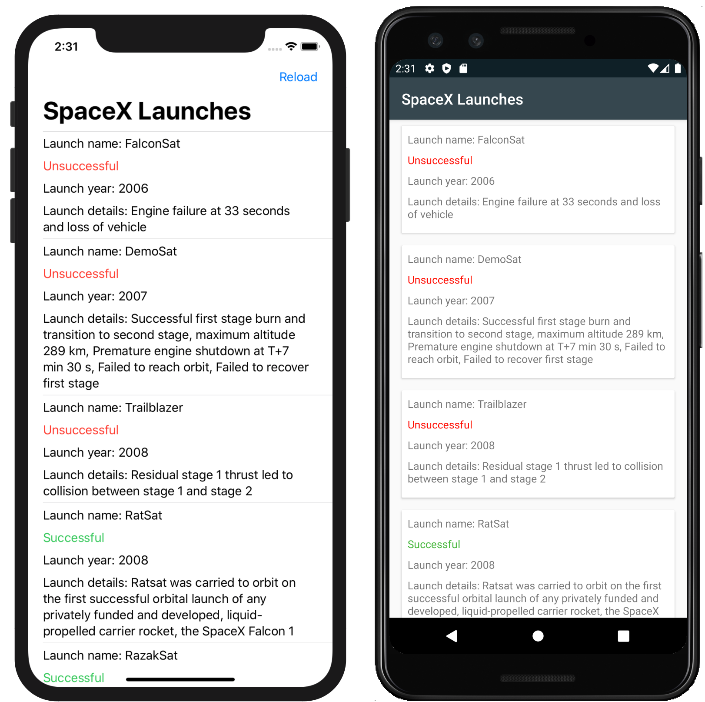

# Summary

Congratulations! We've just created two nice little iOS and Android applications with some of the most common features of mobile clients: retrieving data from the network and caching it in a local database. Our applications have fully native UIs, and we only had to implement the business logic once in the Kotlin Multiplatform Mobile module. 

## What's next?

Check out these guides, if to want to know more about:
- [How to network with Ktor](https://helpserver.labs.jb.gg/help/kotlin-mobile/use-ktor-for-networking.html)
- [How to work with SQLDelight](https://helpserver.labs.jb.gg/help/kotlin-mobile/configure-sqldelight-for-data-storage.html)
- [How to integrate KMM in your existing app](https://helpserver.labs.jb.gg/help/kotlin-mobile/integrate-in-existing-app.html)
- [How to introduce your team to KMM](https://helpserver.labs.jb.gg/help/kotlin-mobile/introduce-your-team-to-kmm.html)

And of course, there's always something to optimize! In this tutorial, we do some potentially heavy operations, like parsing JSON and making requests to the database in the main thread. To learn about how to write concurrent code and optimize your app, see [this series of KMM concurrency articles](https://helpserver.labs.jb.gg/help/kotlin-mobile/concurrency-overview.html)
