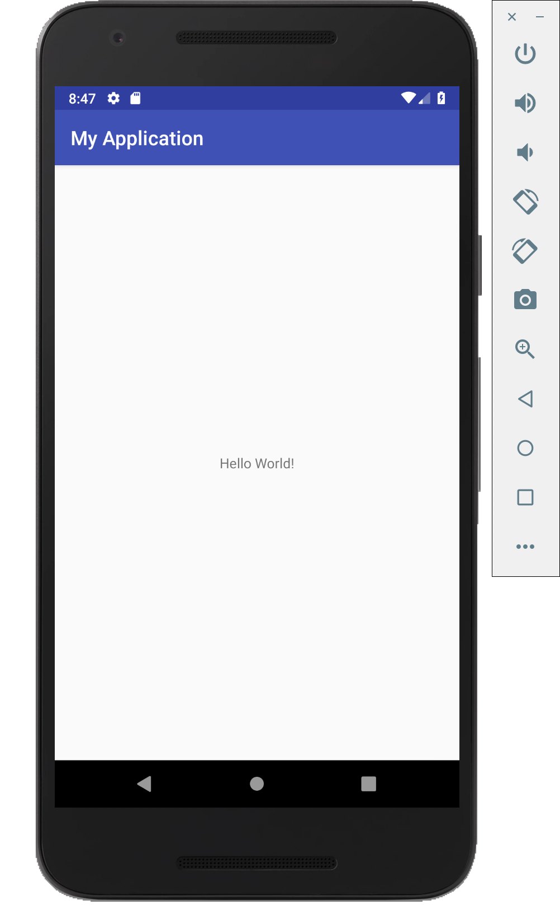

# Creating an Android Project

We need Android Studio for the tutorial. We can download and install it from the
[https://developer.android.com/studio/](https://developer.android.com/studio/). Let's open
the IDE and check that we see the newest Kotlin version, namely 
1.3.50
or newer under the Kotlin section _Languages & Frameworks_ | _Kotlin_
in the _Settings_ (or _Preferences_) dialog of Android Studio.

Our first step is to create a new Android project via the *Start a new Android project* item on the Android Studio home screen. 
We then proceed to select the *Empty Activity* option and click *Next*. It's important to pick the _Kotlin_
language in the wizard. Let's use the `com.jetbrains.handson.mpp.mobile` package
for the tutorial. Now we can press the *Finish* button and create our new Android project.

At this point, we should be able to compile and run the Android application. Let's check that it works!

The `step-002` branch of the 
[github.com/kotlin-hands-on/mpp-ios-android](https://github.com/kotlin-hands-on/mpp-ios-android/tree/step-002)
repository contains a possible solution for the tasks that we have done above. We can also download the
[archive](https://github.com/kotlin-hands-on/mpp-ios-android/archive/step-002.zip) from GitHub directly or
check out the repository and select the branch.

