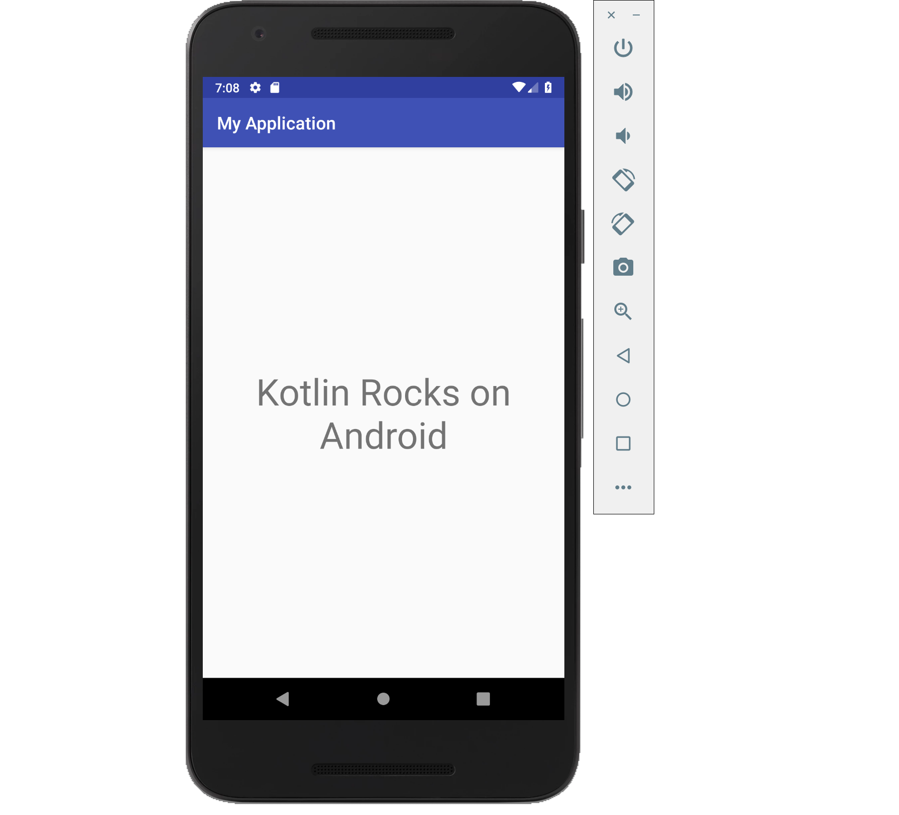

# Shared Kotlin Code for Android

For this tutorial, we want to minimize Android project changes, so we add an ordinary dependency from that 
project to the `SharedCode` project.
It is also possible to use the `kotlin-multiplatform` plugin directly in an Android 
Gradle project, instead of using the `kotlin-android` plugin. For more information, please refer to the
[Multiplatform Projects](/docs/reference/multiplatform.html) documentation.  

Let's include the dependency from the `SharedCode` project to the Android project. We need to patch
the `app/build.gradle` file and add the following line in the `dependencies { .. }` block:

```groovy
    implementation project(':SharedCode')
```

We need to
assign the `id` to the `TextView` control of our activity to access it from the code.
Let's patch the
`app/src/main/res/layout/activity_main.xml` file
(the name may be different if we changed it in the new project wizard). 
Select the _Text_ tab at the bottom of the preview to switch it to XML
and add several more attributes to the `<TextView>` element: 
```
        android:id="@+id/main_text"
        android:textSize="42sp"
        android:layout_margin="5sp"
        android:textAlignment="center"
```

Next, let's add the following line of code to the end of the `onCreate` method from the `MainActivity` class
in the `/app/src/main/java/com/jetbrains/handson/mpp/mobile/MainActivity.kt` file, :

```
findViewById<TextView>(R.id.main_text).text = createApplicationScreenMessage()
```

You will need to add the import for the `android.widget.TextView` class. Android Studio
will automatically suggest adding the import. Depending on the Android application package,
we may also need to add the import for the `createApplicationScreenMessage()` function too.
We should see these two lines at the beginning of the `MainActivity.kt` file:
```kotlin
import com.jetbrains.handson.mpp.mobile.createApplicationScreenMessage
import android.widget.TextView
```

Now we have a `TextView` that will show us the text created by the shared
code function `createApplicationScreenMessage()`. It shows `Kotlin Rocks on Android`.
Let's see how it works by running the Android application.

We can use the `step-005` branch of the 
[github.com/kotlin-hands-on/mpp-ios-android](https://github.com/kotlin-hands-on/mpp-ios-android/tree/step-005)
repository as a solution for the tasks we've done above. We can also download the
[archive](https://github.com/kotlin-hands-on/mpp-ios-android/archive/step-005.zip) from GitHub directly
or check out the repository and select the branch.

## Running the Android Application

Let's click on the `App` run configuration
to get our project running on a real Android device or an emulator. 


And now we can see the Application running in the Android emulator:
    


