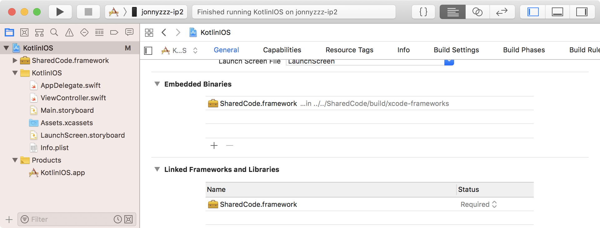
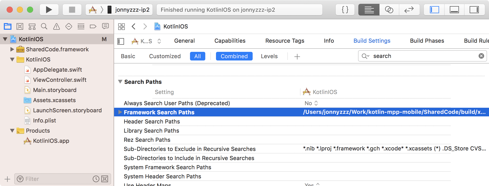
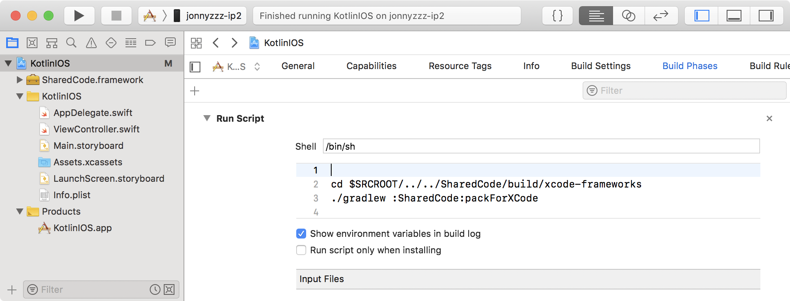
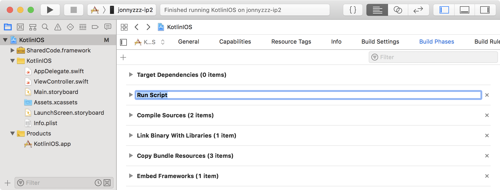
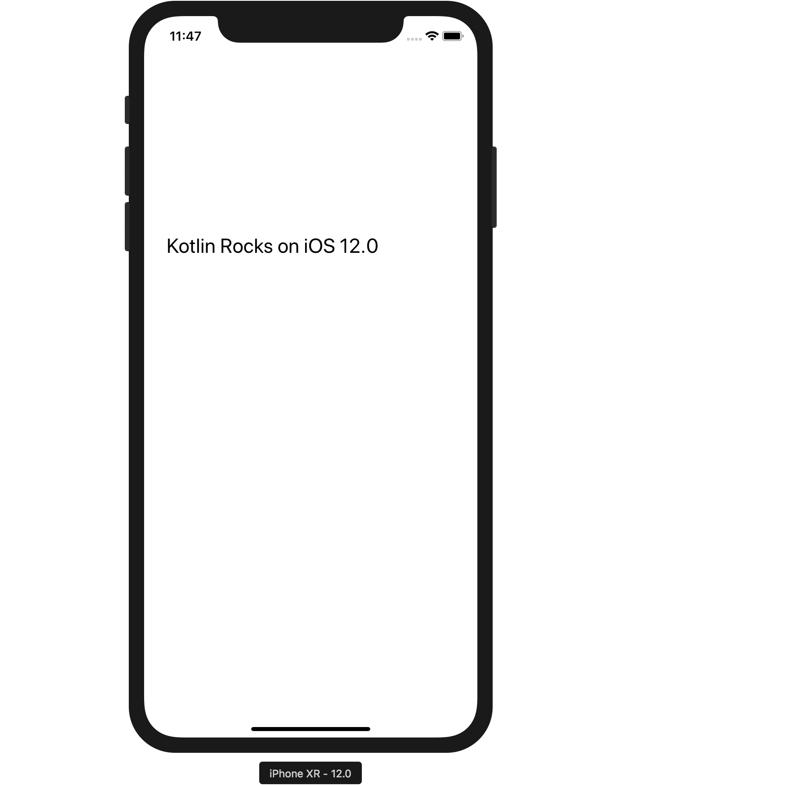

# Shared Kotlin Code for iOS

Let's run the `packForXcode` Gradle task of the `SharedCode` project. We can do it either from
the _Gradle_ tab in AndroidStudio or by running the `./gradlew :SharedCode:packForXcode` command
from console. This task is designed to help to simplify the setup of our iOS Framework
in the Xcode project model.

We need several binaries from the framework to use it with Xcode:

- `iOS arm64 debug` to run on the iOS device in debug mode
- `iOS arm64 release` to include into a release version of an app
- `iOS x64 debug` for the iOS Simulator, which uses the desktop Mac CPU

The easiest way to configure Xcode to use a custom-built framework is to
place the framework under the same folder for all configurations and targets.
Then add a custom step to the Xcode project build to update or build the
framework before the actual Xcode build is started. Xcode sets several environment
variables for custom steps; we can use these variables in the Gradle script to select
the requested target platform and the configuration. For more details,
please refer to the `packForXcode` task sources in the `SharedCode/build.gradle.kts` file. 

Let's now switch back to Android Studio and execute the `build` target of the `SharedCode` project from
the *Gradle* tool window. The task looks for environment variables set by the Xcode build and copies
the right variant of the framework to the `SharedCode/build/xcode-frameworks` folder. We can then include the
framework from that folder into the build

## Setting up Xcode

We need to add the `SharedCode` framework to the Xcode project.
To do this we can double-click on the `KotlinIOS` node (or root node) of the *project navigator (⌘1)* tree
to open the *target* settings.
Next we then click on the `+` in the *Embedded Binaries* section, click *Add Other...* button in the dialog
to choose the framework from the disk. We can then point to the following folder: 
```
SharedCode/build/xcode-frameworks/SharedCode.framework
```

In the next dialog, we need to select the _Create folder references_ option and make sure that the _Copy items if needed_
checkbox isn't checked. We should then see something like this: 


Now we need to explain to Xcode, where to look for the framework.
For this, we open the *Build Settings* tab again, pick the *All* sub-tab below, and type the *Framework Search Paths* into
the search field to find the option easily. We need to add the *relative* path 
`$(SRCROOT)/../../SharedCode/build/xcode-frameworks` to the *Search Paths | Framework Search Paths* section.
Xcode will then show the substituted path in the UI for it.



The final step is to make Xcode call our Gradle build to prepare the `SharedCode` framework before each run.
We can open the *Build Phases* tab and click `+` to add the *New Run Script Phase*, drag that step to the very
first position, and add the following code to the shell script text:

```bash
cd "$SRCROOT/../../SharedCode/build/xcode-frameworks"
./gradlew :SharedCode:packForXCode -PXCODE_CONFIGURATION=${CONFIGURATION}
```

Note, here we use the `$SRCROOT/../..` as the path to the root of our Gradle project.
It can depend on how the Xcode project was created. Also, we use the generated
`SharedCode/build/xcode-frameworks/gradlew` script,
the `packForXCode` task generates it. We assumed that the Gradle build is executed at least once,
*before* opening the Xcode project on a new machine.

The `step-007` branch of the 
[github.com/kotlin-hands-on/mpp-ios-android](https://github.com/kotlin-hands-on/mpp-ios-android/tree/step-007)
repository contains a possible solution for the tasks that we have done above. We can also download the
[archive](https://github.com/kotlin-hands-on/mpp-ios-android/archive/step-007.zip) from GitHub directly or
check out the repository and select the branch.



We should drag the created build phase to the top of the list



We are now ready to start coding the iOS application with Kotlin

## Calling Kotlin Code from Swift

Remember, our goal is to show the text message on the screen. As we see, our iOS application does not draw
anything on the screen. Let's make it show the `UILabel` with the text message.
Let's open the `ViewController.swift` file from the *project navigator (⌘1)* tree.
We need to replace the contents of the `ViewController.swift` file with the following code:
 
```swift
import UIKit
import SharedCode

class ViewController: UIViewController {
    override func viewDidLoad() {
        super.viewDidLoad()
        
        let label = UILabel(frame: CGRect(x: 0, y: 0, width: 300, height: 21))
        label.center = CGPoint(x: 160, y: 285)
        label.textAlignment = .center
        label.font = label.font.withSize(25)
        label.text = CommonKt.createApplicationScreenMessage()
        view.addSubview(label)
    }
}
```
We use the `import SharedCode` to import our Framework, which we compiled with Kotlin/Native from Kotlin code.
Next, we call the Kotlin function from it as `CommonKt.createApplicationScreenMessage()`. Follow the 
[Kotlin/Native as an Apple Framework](/docs/tutorials/native/apple-framework.html) tutorial for
more details on the Kotlin/Native to Swift (or Objective-C) interop.

The `step-008` branch of the 
[github.com/kotlin-hands-on/mpp-ios-android](https://github.com/kotlin-hands-on/mpp-ios-android/tree/step-008)
repository contains a possible solution for the tasks that we have done above. We can also download the
[archive](https://github.com/kotlin-hands-on/mpp-ios-android/archive/step-008.zip) from GitHub directly or
check out the repository and select the branch.

We are now ready to start the application in the simulator or iOS device.

## Running the iOS Application

Let's click the *Run* button in Xcode, and we'll see our application running 


